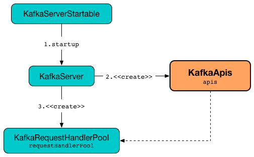

# KafkaApis

`KafkaApis` is responsible to [handle API requests](#handle) to a Kafka broker (by means of [handlers](#handlers)).



Some requests are meant for the [controller broker](controller/index.md) and simply do nothing (_no-ops_) when received by a regular non-controller broker.

## Creating Instance

`KafkaApis` takes the following to be created:

* <span id="requestChannel"> `RequestChannel`
* <span id="metadataSupport"> `MetadataSupport`
* <span id="replicaManager"> [ReplicaManager](ReplicaManager.md)
* [GroupCoordinator](#groupCoordinator)
* [TransactionCoordinator](#txnCoordinator)
* <span id="autoTopicCreationManager"> [AutoTopicCreationManager](AutoTopicCreationManager.md)
* <span id="brokerId"> Broker ID
* <span id="config"> [KafkaConfig](KafkaConfig.md)
* <span id="configRepository"> `ConfigRepository`
* <span id="metadataCache"> [MetadataCache](MetadataCache.md)
* <span id="metrics"> [Metrics](metrics/Metrics.md)
* [Authorizer](#authorizer)
* <span id="quotas"> `QuotaManagers`
* <span id="fetchManager"> `FetchManager`
* <span id="brokerTopicStats"> `BrokerTopicStats`
* <span id="clusterId"> Cluster ID
* <span id="time"> `Time`
* <span id="tokenManager"> `DelegationTokenManager`
* <span id="apiVersionManager"> `ApiVersionManager`

`KafkaApis` is created when:

* `BrokerServer` is requested to [start up](raft/BrokerServer.md#startup) (for the [dataPlaneRequestProcessor](raft/BrokerServer.md#dataPlaneRequestProcessor) and the [controlPlaneRequestProcessor](raft/BrokerServer.md#controlPlaneRequestProcessor))
* `KafkaServer` is requested to [start up](broker/KafkaServer.md#startup) (for the [dataPlaneRequestProcessor](broker/KafkaServer.md#dataPlaneRequestProcessor) and the [controlPlaneRequestProcessor](broker/KafkaServer.md#controlPlaneRequestProcessor))

## <span id="authorizer"> Authorizer

`KafkaApis` can be given an [Authorizer](authorization/Authorizer.md) when [created](#creating-instance). The `Authorizer` instance is given right from the creator (based on [authorizer.class.name](KafkaConfig.md#authorizer.class.name) configuration property):

* [BrokerServer](raft/BrokerServer.md#authorizer)
* [KafkaServer](broker/KafkaServer.md#authorizer)

The `Authorizer` is used only to create the following:

* [AuthHelper](#authHelper)
* [AclApis](#aclApis)

## <span id="authHelper"> AuthHelper

`KafkaApis` creates an [AuthHelper](authorization/AuthHelper.md) when [created](#creating-instance).

The `AuthHelper` is given the optional [Authorizer](#authorizer).

The `AuthHelper` is used to create the [AclApis](#aclApis) and authorize operations.

## <span id="groupCoordinator"> GroupCoordinator

`KafkaApis` is given a [GroupCoordinator](consumer-groups/GroupCoordinator.md) when [created](#creating-instance).

The `GroupCoordinator` is used for the following:

* [handleAddOffsetsToTxnRequest](#handleAddOffsetsToTxnRequest)
* [handleDeleteGroupsRequest](#handleDeleteGroupsRequest)
* [handleDescribeGroupRequest](#handleDescribeGroupRequest)
* [handleFindCoordinatorRequest](#handleFindCoordinatorRequest)
* [handleHeartbeatRequest](#handleHeartbeatRequest)
* [handleJoinGroupRequest](#handleJoinGroupRequest)
* [handleLeaderAndIsrRequest](#handleLeaderAndIsrRequest)
* [handleLeaveGroupRequest](#handleLeaveGroupRequest)
* [handleListGroupsRequest](#handleListGroupsRequest)
* [handleOffsetCommitRequest](#handleOffsetCommitRequest)
* [handleOffsetDeleteRequest](#handleOffsetDeleteRequest)
* [handleOffsetFetchRequest](#handleOffsetFetchRequest)
* [handleStopReplicaRequest](#handleStopReplicaRequest)
* [handleSyncGroupRequest](#handleSyncGroupRequest)
* [handleTxnOffsetCommitRequest](#handleTxnOffsetCommitRequest)
* [handleUpdateMetadataRequest](#handleUpdateMetadataRequest)
* [handleWriteTxnMarkersRequest](#handleWriteTxnMarkersRequest)

## <span id="txnCoordinator"> TransactionCoordinator

`KafkaApis` is given a [TransactionCoordinator](transactions/TransactionCoordinator.md) when [created](#creating-instance).

The `TransactionCoordinator` is used for the following:

* [handleAddOffsetsToTxnRequest](#handleAddOffsetsToTxnRequest)
* [handleAddPartitionToTxnRequest](#handleAddPartitionToTxnRequest)
* [handleEndTxnRequest](#handleEndTxnRequest)
* [handleFindCoordinatorRequest](#handleFindCoordinatorRequest)
* [handleInitProducerIdRequest](#handleInitProducerIdRequest)
* [handleLeaderAndIsrRequest](#handleLeaderAndIsrRequest)
* [handleStopReplicaRequest](#handleStopReplicaRequest)

## <span id="handleFetchRequest"> handleFetchRequest

```scala
handleFetchRequest(
  request: RequestChannel.Request): Unit
```

`handleFetchRequest` assumes that the given `RequestChannel.Request` is an `FetchRequest`.

`handleFetchRequest` authorizes the request.

In the end, `handleFetchRequest` requests the [ReplicaManager](#replicaManager) to [fetchMessages](ReplicaManager.md#fetchMessages).

`handleFetchRequest` is used when:

* `KafkaApis` is requested to [handle a FETCH request](#handle)

## <span id="handleFindCoordinatorRequest"><span id="handleFindCoordinatorRequestV4AndAbove"> handleFindCoordinatorRequest

```scala
handleFindCoordinatorRequest(
  request: RequestChannel.Request): Unit
```

`handleFindCoordinatorRequest` converts the given `RequestChannel.Request` to an `FindCoordinatorRequest`.

`handleFindCoordinatorRequest` [finds the group or transaction coordinator](#getCoordinator).

In the end, `handleFindCoordinatorRequest` prints out the following TRACE message to the logs:

```text
Sending FindCoordinator response [response] for correlation id [correlationId] to client [clientId].
```

---

`handleFindCoordinatorRequest` is used when:

* `KafkaApis` is requested to [handle a FIND_COORDINATOR request](#handle)

### <span id="getCoordinator"> Finding Group or Transaction Coordinator

```scala
getCoordinator(
  request: RequestChannel.Request,
  keyType: Byte,
  key: String): (Errors, Node)
```

#### <span id="getCoordinator-authorize"> Authorization

For `GROUP` coordinator (by the `keyType`), `getCoordinator` requests the [AuthHelper](#authHelper) to [authorize](authorization/AuthHelper.md#authorize):

* `DESCRIBE` operation
* `GROUP` resource type
* `key` resource name

For `TRANSACTION` coordinator (by the `keyType`), `getCoordinator` requests the [AuthHelper](#authHelper) to [authorize](authorization/AuthHelper.md#authorize):

* `DESCRIBE` operation
* `TRANSACTIONAL_ID` resource type
* `key` resource name

If either fails, `getCoordinator` returns the `Errors`.

#### <span id="getCoordinator-partition"> Partition

For `GROUP` coordinator (by the `keyType`), `getCoordinator` requests the [GroupCoordinator](#groupCoordinator) for the [partition](consumer-groups/GroupCoordinator.md#partitionFor) of the `key` group.

For `TRANSACTION` coordinator (by the `keyType`), `getCoordinator` requests the [TransactionCoordinator](#txnCoordinator) for the [partition](transactions/TransactionCoordinator.md#partitionFor) of the `key` transactional ID.

#### <span id="getCoordinator-topicMetadata"> Topic Metadata

`getCoordinator` requests the [MetadataCache](#metadataCache) to [getTopicMetadata](MetadataCache.md#getTopicMetadata) with the name of the internal topic and then to [getAliveBrokerNode](MetadataCache.md#getAliveBrokerNode).

Possible errors are `COORDINATOR_NOT_AVAILABLE`s.

## <span id="handleInitProducerIdRequest"> handleInitProducerIdRequest

```scala
handleInitProducerIdRequest(
  request: RequestChannel.Request): Unit
```

`handleInitProducerIdRequest` assumes that the given `RequestChannel.Request` is an `InitProducerIdRequest`.

`handleInitProducerIdRequest` authorizes the request.

With `producerId` and `producerEpoch` set either to `-1`s (`NO_PRODUCER_ID` and `NO_PRODUCER_EPOCH`) or some non-`-1` values, `handleInitProducerIdRequest` requests the [TransactionCoordinator](#txnCoordinator) to [handleInitProducerId](transactions/TransactionCoordinator.md#handleInitProducerId).

Otherwise, `handleInitProducerIdRequest` sends an error back.

`handleInitProducerIdRequest` is used when:

* `KafkaApis` is requested to [handle a INIT_PRODUCER_ID request](#handle)

## <span id="handleLeaderAndIsrRequest"> handleLeaderAndIsrRequest

```scala
handleLeaderAndIsrRequest(
  request: RequestChannel.Request): Unit
```

In summary, `handleLeaderAndIsrRequest` requests the [ReplicaManager](#replicaManager) to [become the leader or a follower (of partitions)](ReplicaManager.md#becomeLeaderOrFollower).

---

`handleLeaderAndIsrRequest` expects the given `RequestChannel.Request` to be an [LeaderAndIsrRequest](controller/LeaderAndIsrRequest.md).

`handleLeaderAndIsrRequest` requests the [AuthHelper](#authHelper) to [authorize](authorization/AuthHelper.md#authorizeClusterOperation) `CLUSTER_ACTION` operation.

In the end, `handleLeaderAndIsrRequest` requests the [ReplicaManager](#replicaManager) to [become the leader or a follower (of partitions)](ReplicaManager.md#becomeLeaderOrFollower) (with a `correlationId` and [onLeadershipChange](RequestHandlerHelper.md#onLeadershipChange) handler).

---

`handleLeaderAndIsrRequest` is used when:

* `KafkaApis` is requested to [handle a LEADER_AND_ISR request](#handle)

## <span id="handleIncrementalAlterConfigsRequest"> handleIncrementalAlterConfigsRequest

```scala
handleIncrementalAlterConfigsRequest(
  request: RequestChannel.Request): Unit
```

`handleIncrementalAlterConfigsRequest`...FIXME

---

`handleIncrementalAlterConfigsRequest` is used when:

* `KafkaApis` is requested to [handle a INCREMENTAL_ALTER_CONFIGS request](#handle)

### <span id="processIncrementalAlterConfigsRequest"> processIncrementalAlterConfigsRequest

```scala
processIncrementalAlterConfigsRequest(
  originalRequest: RequestChannel.Request,
  data: IncrementalAlterConfigsRequestData): IncrementalAlterConfigsResponseData
```

`processIncrementalAlterConfigsRequest`...FIXME

* FIXME

## <span id="handle"> Handling API Request

```scala
handle(
  request: RequestChannel.Request,
  requestLocal: RequestLocal): Unit
```

`handle` is part of the [ApiRequestHandler](ApiRequestHandler.md#handle) abstraction.

---

`handle` prints out the following TRACE message to the logs:

```text
Handling request:[request] from connection [id];securityProtocol:[protocol],principal:[principal]
```

`handle` handles the given `RequestChannel.Request` (based on the `apiKey` in the header) using the corresponding handler.

API Key | Handler
--------|--------
 [LeaderAndIsr](controller/LeaderAndIsrRequest.md#LeaderAndIsr) | [handleLeaderAndIsrRequest](#handleLeaderAndIsrRequest)
 `INCREMENTAL_ALTER_CONFIGS` | [handleIncrementalAlterConfigsRequest](#handleIncrementalAlterConfigsRequest)
 _others_ |

## Logging

Enable `ALL` logging level for `kafka.server.KafkaApis` logger to see what happens inside.

Add the following line to `config/log4j.properties`:

```text
log4j.logger.kafka.server.KafkaApis=ALL
```

Refer to [Logging](logging.md).

---

Please note that Kafka comes with a preconfigured `kafka.server.KafkaApis` logger in `config/log4j.properties`:

```text
log4j.appender.requestAppender=org.apache.log4j.DailyRollingFileAppender
log4j.appender.requestAppender.DatePattern='.'yyyy-MM-dd-HH
log4j.appender.requestAppender.File=${kafka.logs.dir}/kafka-request.log
log4j.appender.requestAppender.layout=org.apache.log4j.PatternLayout
log4j.appender.requestAppender.layout.ConversionPattern=[%d] %p %m (%c)%n

log4j.logger.kafka.server.KafkaApis=TRACE, requestAppender
log4j.additivity.kafka.server.KafkaApis=false
```

That means that the logs of `KafkaApis` go to `logs/kafka-request.log` file at `TRACE` logging level and are not added to the main logs (per `log4j.additivity` being off).
