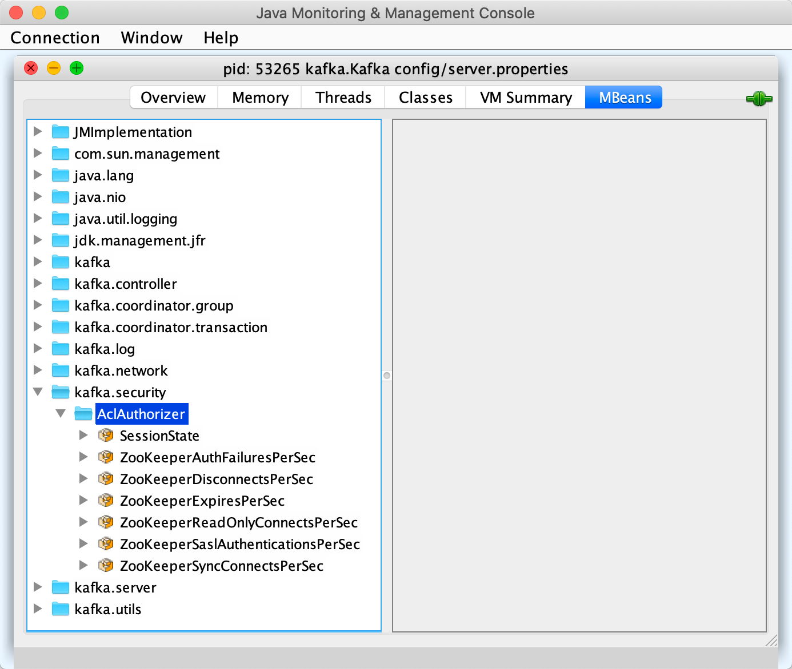

# AclAuthorizer

`AclAuthorizer` (`kafka.security.authorizer.AclAuthorizer`) is an [Authorizer](Authorizer.md) that uses [Apache Zookeeper](#zkClient) to persist ACLs.

!!! note
    `AclAuthorizer` is available since Apache Kafka 2.4.0 (and [KIP-504 - Add new Java Authorizer Interface](https://cwiki.apache.org/confluence/display/KAFKA/KIP-504+-+Add+new+Java+Authorizer+Interface)).

## Demo

[Demo: ACL Authorization](../demo/acl-authorization.md)

## Configuration Properties

### <span id="shouldAllowEveryoneIfNoAclIsFound"><span id="AllowEveryoneIfNoAclIsFoundProp"><span id="allow.everyone.if.no.acl.found"> allow.everyone.if.no.acl.found

Controls whether or not the authorizer allows access to everyone when no acls are found for a resource.

Default: `false`

Used when:

* [authorizeByResourceType](#authorizeByResourceType)
* [authorizeAction](#authorizeAction)

### <span id="authorizer.zookeeper.connection.timeout.ms"> authorizer.zookeeper.connection.timeout.ms

Default: [zkConnectionTimeoutMs](../KafkaConfig.md#zkConnectionTimeoutMs)

### <span id="authorizer.zookeeper.max.in.flight.requests"> authorizer.zookeeper.max.in.flight.requests

Default: [zookeeper.max.in.flight.requests](../KafkaConfig.md#zookeeper.max.in.flight.requests)

### <span id="authorizer.zookeeper.session.timeout.ms"> authorizer.zookeeper.session.timeout.ms

Default: [zookeeper.session.timeout.ms](../KafkaConfig.md#zookeeper.session.timeout.ms)

### <span id="authorizer.zookeeper.url"> authorizer.zookeeper.url

URL of the dedicated Zookeeper to store ACLs

Default: [zookeeper.connect](../KafkaConfig.md#zookeeper.connect)

### <span id="superUsers"><span id="super.users"> super.users

A `;`-separated list of `KafkaPrincipal`s (in format `type:name`) of super users who [are allowed to execute operations without checking ACLs](#isSuperUser) (e.g., have access to all the resources for all actions from all hosts).

Default: (empty)

## <span id="zkClient"> KafkaZkClient

`AclAuthorizer` creates a [KafkaZkClient](../zk/KafkaZkClient.md) in [configure](#configure) and immediately requests it to [createAclPaths](../zk/KafkaZkClient.md#createAclPaths).

This `KafkaZkClient` can use its own dedicated Zookeeper to store ACLs based on the [configuration properties](#configuration-properties).

The `KafkaZkClient` is used when:

* [loadCache](#loadCache)
* [startZkChangeListeners](#startZkChangeListeners)
* [updateResourceAcls](#updateResourceAcls)
* [getAclsFromZk](#getAclsFromZk)
* [updateAclChangedFlag](#updateAclChangedFlag)

## <span id="configure"> configure

```scala
configure(
  javaConfigs: ju.Map[String, _]): Unit
```

`configure` is part of the [Configurable](../Configurable.md#configure) abstraction.

---

`configure` sets up [superUsers](#super.users).

`configure` reads the [authorizer-specific configuration properties](#configuration-properties) and the following:

* [zookeeper.set.acl](../KafkaConfig.md#zookeeper.set.acl)

`configure` [zkClientConfigFromKafkaConfigAndMap](#zkClientConfigFromKafkaConfigAndMap) for a `ZKClientConfig`.

`configure` creates a [KafkaZkClient](../zk/KafkaZkClient.md) (with the properties) and the following:

* `ACL authorizer` name
* `kafka.security` metric group
* `AclAuthorizer` metric type



`configure` requests the `KafkaZkClient` to [createAclPaths](../zk/KafkaZkClient.md#createAclPaths).

`configure` sets up [extendedAclSupport](#extendedAclSupport) flag.

In the end, `configure` [startZkChangeListeners](#startZkChangeListeners) and [loadCache](#loadCache).

## <span id="aclChangeListeners"> AclChangeSubscription Listeners

`AclAuthorizer` initializes `AclChangeSubscription` listeners when [startZkChangeListeners](#startZkChangeListeners).

!!! note
    The list of `AclChangeSubscription` listeners is fixed.

## <span id="extendedAclSupport"> extendedAclSupport

`AclAuthorizer` uses `extendedAclSupport` flag to...FIXME

## <span id="isSuperUser"> isSuperUser

```scala
isSuperUser(
  principal: KafkaPrincipal): Boolean
```

`isSuperUser` checks whether or not the `KafkaPrincipal` is a [superuser](#superUsers).

If so, `isSuperUser` prints out the following DEBUG message to the logs and returns `true`.

```text
principal = [principal] is a super user, allowing operation without checking acls.
```

Otherwise, `isSuperUser` returns `false`.

---

`isSuperUser` is used when:

* `AclAuthorizer` is requested to [authorizeByResourceType](#authorizeByResourceType) and [authorizeAction](#authorizeAction)

## Logging

Enable `ALL` logging level for `kafka.authorizer.logger` logger to see what happens inside.

Add the following line to `confing/log4j.properties`:

```text
log4j.logger.kafka.authorizer.logger=ALL
```

Refer to [Logging](../logging.md).

!!! note
    Please note that Kafka comes with a preconfigured `kafka.authorizer.logger` logger in `config/log4j.properties`:

    ```
    log4j.appender.authorizerAppender=org.apache.log4j.DailyRollingFileAppender
    log4j.appender.authorizerAppender.DatePattern='.'yyyy-MM-dd-HH
    log4j.appender.authorizerAppender.File=${kafka.logs.dir}/kafka-authorizer.log
    log4j.appender.authorizerAppender.layout=org.apache.log4j.PatternLayout
    log4j.appender.authorizerAppender.layout.ConversionPattern=[%d] %p %m (%c)%n

    # Access denials are logged at INFO level, change to DEBUG to also log allowed accesses
    log4j.logger.kafka.authorizer.logger=INFO, authorizerAppender
    log4j.additivity.kafka.authorizer.logger=false
    ```

    That means that the logs of `AclAuthorizer` go to `logs/kafka-authorizer.log` file at `INFO` logging level and are not added to the main logs (per `log4j.additivity` being off).
