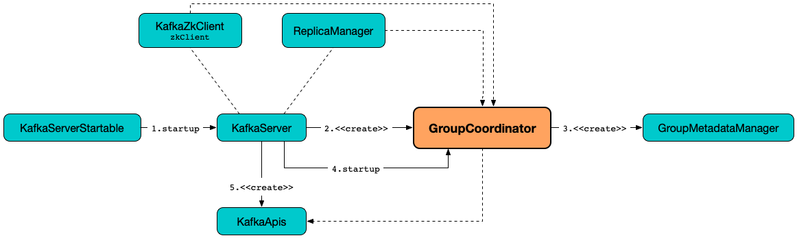

# GroupCoordinator



`GroupCoordinator` is [elected](#onElection) as the group coordinator for every partition to handle consumer groups that are "assigned" to this partition. There are going to be as many `GroupCoordinator`s as there are [offsets.topic.num.partitions](../KafkaConfig.md#offsetsTopicPartitions).

## Creating Instance

`GroupCoordinator` takes the following to be created:

* <span id="brokerId"> [broker.id](../KafkaConfig.md#brokerId)
* [GroupConfig](#groupConfig)
* <span id="offsetConfig"> [OffsetConfig](OffsetConfig.md)
* <span id="groupManager"> [GroupMetadataManager](GroupMetadataManager.md)
* <span id="heartbeatPurgatory"> `DelayedOperationPurgatory[DelayedHeartbeat]`
* <span id="rebalancePurgatory"> `DelayedOperationPurgatory[DelayedRebalance]`
* <span id="time"> `Time`
* <span id="metrics"> [Metrics](../metrics/Metrics.md)

`GroupCoordinator` is created using [apply](#apply) factory.

## <span id="groupConfig"><span id="GroupConfig"> GroupConfig

`GroupCoordinator` is given a `GroupConfig` when [created](#creating-instance).

`GroupConfig` is a collection of the configuration properties:

* [groupMinSessionTimeoutMs](../KafkaConfig.md#groupMinSessionTimeoutMs)
* [groupMaxSessionTimeoutMs](../KafkaConfig.md#groupMaxSessionTimeoutMs)
* [groupMaxSize](../KafkaConfig.md#groupMaxSize)
* [groupInitialRebalanceDelay](../KafkaConfig.md#groupInitialRebalanceDelay)

## <span id="apply"> Creating GroupCoordinator Instance

```scala
apply(
  config: KafkaConfig,
  replicaManager: ReplicaManager,
  time: Time,
  metrics: Metrics): GroupCoordinator // (1)!
apply(
  config: KafkaConfig,
  replicaManager: ReplicaManager,
  heartbeatPurgatory: DelayedOperationPurgatory[DelayedHeartbeat],
  rebalancePurgatory: DelayedOperationPurgatory[DelayedRebalance],
  time: Time,
  metrics: Metrics): GroupCoordinator
```

1. Creates `DelayedOperationPurgatory`s and calls the other `apply`

!!! note
    All `GroupCoordinator` really needs for work is [ReplicaManager](../ReplicaManager.md).

`apply` [creates an OffsetConfig](#offsetConfig-KafkaConfig) (based on the given [KafkaConfig](../KafkaConfig.md)).

`apply` creates a [GroupConfig](#GroupConfig).

`apply` creates a [GroupMetadataManager](GroupMetadataManager.md) based on the following configuration properties (in the [KafkaConfig](../KafkaConfig.md)):

* [broker.id](../KafkaConfig.md#brokerId)
* [interBrokerProtocolVersion](../KafkaConfig.md#interBrokerProtocolVersion)

In the end, `apply` creates a [GroupCoordinator](GroupCoordinator.md).

---

`apply` is used when:

* `BrokerServer` is requested to [start up](../raft/BrokerServer.md#groupCoordinator)
* `KafkaServer` is requested to [start up](../broker/KafkaServer.md#groupCoordinator)

### <span id="offsetConfig"><span id="offsetConfig-KafkaConfig"> Creating OffsetConfig

```scala
offsetConfig(
  config: KafkaConfig): OffsetConfig
```

`offsetConfig` uses the [KafkaConfig](../KafkaConfig.md) for the following configuration properties to create an [OffsetConfig](OffsetConfig.md):

* [offsetMetadataMaxSize](../KafkaConfig.md#offsetMetadataMaxSize)
* [offsetsLoadBufferSize](../KafkaConfig.md#offsetsLoadBufferSize)
* [offsetsRetentionMinutes](../KafkaConfig.md#offsetsRetentionMinutes)
* [offsetsRetentionCheckIntervalMs](../KafkaConfig.md#offsetsRetentionCheckIntervalMs)
* [offsets.topic.num.partitions](../KafkaConfig.md#offsetsTopicPartitions)
* [offsetsTopicSegmentBytes](../KafkaConfig.md#offsetsTopicSegmentBytes)
* [offsetsTopicReplicationFactor](../KafkaConfig.md#offsetsTopicReplicationFactor)
* [offsetsTopicCompressionCodec](../KafkaConfig.md#offsetsTopicCompressionCodec)
* [offsetCommitTimeoutMs](../KafkaConfig.md#offsetCommitTimeoutMs)
* [offsetCommitRequiredAcks](../KafkaConfig.md#offsetCommitRequiredAcks)

## <span id="onElection"> onElection

```scala
onElection(
  offsetTopicPartitionId: Int,
  coordinatorEpoch: Int): Unit
```

`onElection` prints out the following INFO message to the logs:

```text
Elected as the group coordinator for partition [offsetTopicPartitionId] in epoch [coordinatorEpoch]
```

`onElection` requests the [GroupMetadataManager](#groupManager) to [scheduleLoadGroupAndOffsets](GroupMetadataManager.md#scheduleLoadGroupAndOffsets).

---

`onElection` is used when:

* `RequestHandlerHelper` is requested to `onLeadershipChange` for [__consumer_offsets](index.md#__consumer_offsets)
* `BrokerMetadataPublisher` is requested to `publish` metadata for [__consumer_offsets](index.md#__consumer_offsets)

## Logging

Enable `ALL` logging level for `kafka.coordinator.group.GroupCoordinator` logger to see what happens inside.

Add the following line to `conf/log4j.properties`:

```text
log4j.logger.kafka.coordinator.group.GroupCoordinator=ALL
```

Refer to [Logging](../logging.md).
