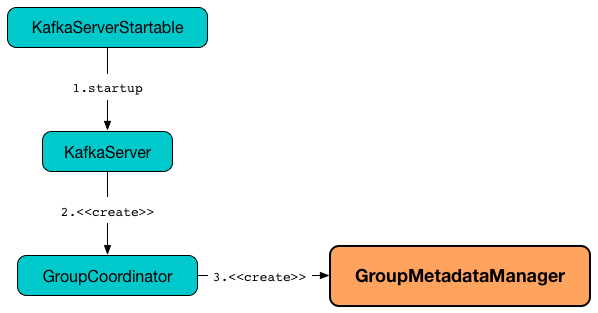
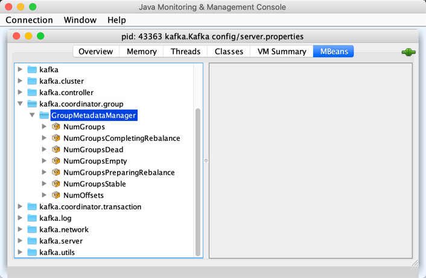

# GroupMetadataManager



## Creating Instance

`GroupMetadataManager` takes the following to be created:

* <span id="brokerId"> [broker.id](../KafkaConfig.md#brokerId)
* <span id="interBrokerProtocolVersion"> [ApiVersion](../KafkaConfig.md#interBrokerProtocolVersion)
* <span id="config"> [OffsetConfig](OffsetConfig.md)
* <span id="replicaManager"> [ReplicaManager](../ReplicaManager.md)
* <span id="time"> `Time`
* <span id="metrics"> [Metrics](../metrics/Metrics.md)

`GroupMetadataManager` is created alongside a [GroupCoordinator](GroupCoordinator.md#groupManager).

## Performance Metrics

`GroupMetadataManager` is a [KafkaMetricsGroup](../metrics/KafkaMetricsGroup.md) and registers the following performance metrics in **kafka.coordinator.group:type=GroupMetadataManager** group.

Metric Name | Description
------------|------------
 NumGroups |
 NumGroupsCompletingRebalance |
 NumGroupsDead |
 NumGroupsEmpty |
 NumGroupsPreparingRebalance |
 NumGroupsStable |
 NumOffsets |



## Logging

Enable `ALL` logging level for `kafka.coordinator.group.GroupMetadataManager` logger to see what happens inside.

Add the following line to `config/log4j.properties`:

```text
log4j.logger.kafka.coordinator.group.GroupMetadataManager=ALL
```

Refer to [Logging](../logging.md).
