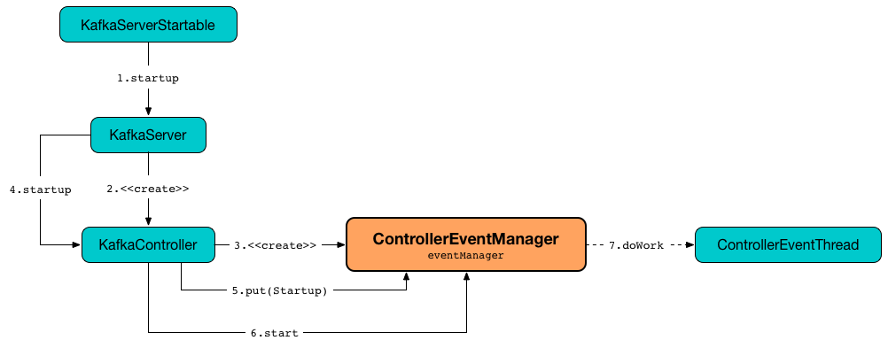
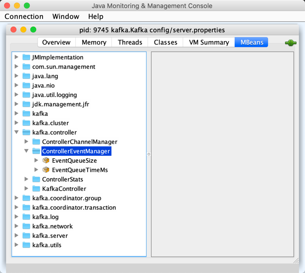

# ControllerEventManager

`ControllerEventManager` manages the [event queue](#queue) and the [controller-event-thread](#thread) (for [event processing](ControllerEventThread.md#doWork)) for [KafkaController](KafkaController.md).



## Creating Instance

`ControllerEventManager` takes the following to be created:

* <span id="controllerId"> Controller ID (i.e. the [broker.id](../KafkaConfig.md#broker.id) of the broker)
* <span id="processor"> [ControllerEventProcessor](ControllerEventProcessor.md)
* <span id="time"> `Time`
* [rateAndTimeMetrics](#rateAndTimeMetrics)
* <span id="eventQueueTimeTimeoutMs"> `eventQueueTimeTimeoutMs` (default: 300000)

`ControllerEventManager` is created when:

* `KafkaController` is [created](KafkaController.md#eventManager)

### <span id="rateAndTimeMetrics"> rateAndTimeMetrics

```scala
rateAndTimeMetrics: Map[ControllerState, KafkaTimer]
```

`ControllerEventManager` is given `rateAndTimeMetrics` that are `KafkaTimers` per [ControllerState](ControllerState.md).

## Performance Metrics

`ControllerEventManager` is a [KafkaMetricsGroup](../metrics/KafkaMetricsGroup.md) and registers the following performance metrics in **kafka.controller:type=ControllerEventManager** group.



### <span id="EventQueueSize"> EventQueueSize

Number of [QueuedEvent](QueuedEvent.md)s in the [event queue](#queue)

### <span id="EventQueueTimeMs"> EventQueueTimeMs

## <span id="queue"> Event Queue

`ControllerEventManager` creates a `LinkedBlockingQueue` ([Java]({{ java.api }}/java/util/concurrent/LinkedBlockingQueue.html)) of [QueuedEvent](QueuedEvent.md)s.

!!! note "LinkedBlockingQueue"
    `LinkedBlockingQueue` is an optionally-bounded blocking queue based on linked nodes that orders elements in first-in-first-out fashion.

Use [EventQueueSize](#EventQueueSize) metric to monitor the depth of the queue.

The `LinkedBlockingQueue` is used to:

* [put a ControllerEvent](#put)
* [clearAndPut](#clearAndPut)
* [pollFromEventQueue](#pollFromEventQueue)

## <span id="put"> Emitting (Enqueuing) Controller Event

```scala
put(
  event: ControllerEvent): QueuedEvent
```

`put` creates a [QueuedEvent](QueuedEvent.md) with the input [ControllerEvent](ControllerEvent.md) and adds it to the end of the [event queue](#queue).

---

`put` is used when:

* `ControllerBrokerRequestBatch` is requested to [sendEvent](ControllerBrokerRequestBatch.md#sendEvent)
* `ControllerEventManager` is requested to [clearAndPut](#clearAndPut)
* [KafkaController](KafkaController.md) is doing its operation (and emits events)

## <span id="start"> Starting ControllerEventThread

```scala
start(): Unit
```

`start` requests the [ControllerEventThread](#thread) to [start processing ControllerEvents](ControllerEventThread.md#doWork).

`start` is used when:

* `KafkaController` is requested to [start up](KafkaController.md#startup)

## <span id="thread"> controller-event-thread

`ControllerEventManager` creates a [ControllerEventThread](ControllerEventThread.md) when [created](#creating-instance).

The name of `ControllerEventThread` is **controller-event-thread**.

The `ControllerEventThread` is requested to [start](ControllerEventThread.md#doWork) when [start](#start) and runs until [close](#close).

## <span id="_state"> ControllerState

`ControllerEventManager` is in one of the possible [ControllerState](ControllerState.md)s:

* [Idle](ControllerState.md#Idle) when `ControllerEventManager` is [created](#creating-instance) and right after `ControllerEventThread` has finished [processing a controller event](ControllerEventThread.md#doWork)

* State transitions happen per the [requested state](ControllerEvent.md#state) of the `ControllerEvent` being processed (while `ControllerEventThread` is [processing controller events](ControllerEventThread.md#doWork))

!!! note
    The state of `ControllerEventManager` is exactly the state of the parent [KafkaController](KafkaController.md#state).
