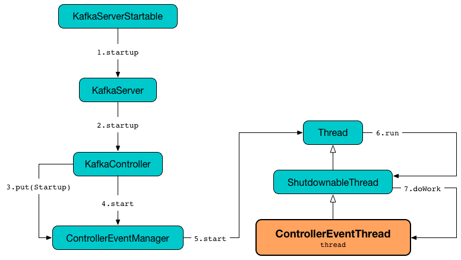

# ControllerEventThread

`ControllerEventThread` is a `ShutdownableThread` that [ControllerEventManager](ControllerEventManager.md#thread) uses to [process QueuedEvents](#doWork) (asynchronously on a separate thread).



## Review Me

`ControllerEventThread` is a `ShutdownableThread` that is <<creating-instance, created>> for <<kafka-controller-ControllerEventManager.adoc#, >> (with the <<name, name>> being *controller-event-thread*).

```text
// jstack [brokerPid]
"controller-event-thread" #42 prio=5 os_prio=31 cpu=387,10ms elapsed=82679,68s tid=0x00007f920e489800 nid=0x14703 waiting on condition  [0x000070000fcea000]
   java.lang.Thread.State: WAITING (parking)
	at jdk.internal.misc.Unsafe.park(java.base@12.0.2/Native Method)
	- parking to wait for  <0x00000007c07f0298> (a java.util.concurrent.locks.AbstractQueuedSynchronizer$ConditionObject)
	at java.util.concurrent.locks.LockSupport.park(java.base@12.0.2/LockSupport.java:194)
	at java.util.concurrent.locks.AbstractQueuedSynchronizer$ConditionObject.await(java.base@12.0.2/AbstractQueuedSynchronizer.java:2081)
	at java.util.concurrent.LinkedBlockingQueue.take(java.base@12.0.2/LinkedBlockingQueue.java:433)
	at kafka.controller.ControllerEventManager$ControllerEventThread.doWork(ControllerEventManager.scala:127)
	at kafka.utils.ShutdownableThread.run(ShutdownableThread.scala:89)
```

`ControllerEventThread` is <<doWork, started>> with <<kafka-controller-ControllerEventManager.adoc#start, ControllerEventManager>>.

[[creating-instance]][[name]]
`ControllerEventThread` takes the name of the thread to be created.

[[logIdent]]
`ControllerEventThread` uses *[ControllerEventThread controllerId=[controllerId]]* as the logging prefix (aka `logIdent`).

=== [[doWork]] Processing Controller Events -- `doWork` Method

[source, scala]
----
doWork(): Unit
----

`doWork` takes (and removes) a <<kafka-controller-QueuedEvent.adoc#, QueuedEvent>> from the head of the <<kafka-controller-ControllerEventManager.adoc#queue, event queue>> (waiting for a `QueuedEvent` to be available if the queue is empty).

NOTE: The very first event in the event queue is `Startup` that `KafkaController` puts when it is link:kafka-controller-KafkaController.adoc#startup[started].

`doWork` sets <<kafka-controller-ControllerEventManager.adoc#_state, _state>> (of `ControllerEventManager`) to be the <<kafka-controller-ControllerEvent.adoc#state, state>> of the controller event.

`doWork` requests the <<kafka-controller-ControllerEventManager.adoc#eventQueueTimeHist, EventQueueTimeMs histogram>> to `update` (with the time between the current time and the <<kafka-controller-QueuedEvent.adoc#enqueueTimeMs, enqueue time of the event>>).

`doWork` finds the `KafkaTimer` for the current controller state (in <<kafka-controller-ControllerEventManager.adoc#rateAndTimeMetrics, rateAndTimeMetrics>> lookup table) to measure and record the time to requests the event to <<kafka-controller-QueuedEvent.adoc#process, process>> using the <<kafka-controller-ControllerEventManager.adoc#processor, ControllerEventProcessor>>.

In the end, `doWork` sets the <<kafka-controller-ControllerEventManager.adoc#_state, _state>> (of `ControllerEventManager`) as `Idle`.

In case of any error (`Throwable`), `doWork` simply prints out the following ERROR message to the logs:

```
Uncaught error processing event [controllerEvent]
```
