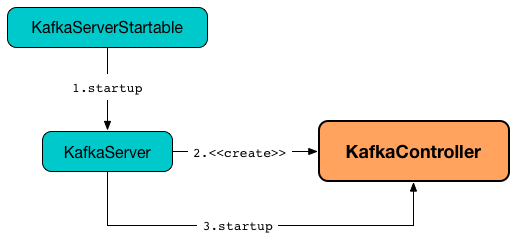

# KafkaController

`KafkaController` is [created](#creating-instance) and immediately [started](#startup) alongside [KafkaServer](../broker/KafkaServer.md#startup).



`KafkaController` uses [listeners](#listeners) as a notification system to react to changes in Zookeeper.

`KafkaController` is a state machine (using [controller events](#controller-events)).

## Creating Instance

`KafkaController` takes the following to be created:

* <span id="config"> [KafkaConfig](../KafkaConfig.md)
* <span id="zkClient"> [KafkaZkClient](../zk/KafkaZkClient.md)
* <span id="time"> `Time`
* <span id="metrics"> [Metrics](../metrics/Metrics.md)
* <span id="initialBrokerInfo"> `BrokerInfo`
* <span id="initialBrokerEpoch"> `initialBrokerEpoch`
* <span id="tokenManager"> `DelegationTokenManager`
* <span id="brokerFeatures"> `BrokerFeatures`
* <span id="featureCache"> `FinalizedFeatureCache`
* <span id="threadNamePrefix"> Thread name prefix (default: undefined)

`KafkaController` is created when:

* `KafkaServer` is requested to [start up](../broker/KafkaServer.md#_kafkaController)

## <span id="controllerContext"> ControllerContext

`KafkaController` creates a [ControllerContext](ControllerContext.md) when [created](#creating-instance).

## <span id="controllerChannelManager"> ControllerChannelManager

`KafkaController` creates a `ControllerChannelManager` when [created](#creating-instance).

`ControllerChannelManager` is used to create separate `ControllerBrokerRequestBatch`es of the [KafkaController](#brokerRequestBatch) itself, the [ZkReplicaStateMachine](#replicaStateMachine) and [ZkPartitionStateMachine](#partitionStateMachine).

`ControllerChannelManager` is requested to start up when `KafkaController` is requested to start [controller election](#elect) (and a broker is successfully elected as the active controller).

`KafkaController` uses the `ControllerChannelManager` to add or remove brokers when [processing broker changes in Zookeeper](#processBrokerChange) (a new or updated znode under `/brokers/ids` path).

`ControllerChannelManager` is requested to shut down when `KafkaController` is requested to [resign as the active controller](#onControllerResignation).

## Performance Metrics

`KafkaController` is a [KafkaMetricsGroup](../metrics/KafkaMetricsGroup.md).

### <span id="ActiveControllerCount"> ActiveControllerCount

`1` if [isActive](#isActive). `0` otherwise.

### <span id="OfflinePartitionsCount"> OfflinePartitionsCount

### <span id="PreferredReplicaImbalanceCount"> PreferredReplicaImbalanceCount

### <span id="ControllerState"> ControllerState

### <span id="GlobalTopicCount"> GlobalTopicCount

### <span id="GlobalPartitionCount"> GlobalPartitionCount

### <span id="TopicsToDeleteCount"> TopicsToDeleteCount

### <span id="ReplicasToDeleteCount"> ReplicasToDeleteCount

### <span id="TopicsIneligibleToDeleteCount"> TopicsIneligibleToDeleteCount

### <span id="ReplicasIneligibleToDeleteCount"> ReplicasIneligibleToDeleteCount

### <span id="ActiveBrokerCount"> ActiveBrokerCount

### <span id="FencedBrokerCount"> FencedBrokerCount

## <span id="ControllerEventProcessor"> ControllerEventProcessor

`KafkaController` is a `ControllerEventProcessor` to [process](#process) and [preempt](#preempt) controller events.

## <span id="onControllerResignation"> Resigning As Active Controller

```scala
onControllerResignation(): Unit
```

`onControllerResignation` starts by printing out the following DEBUG message to the logs:

```text
Resigning
```

`onControllerResignation` unsubscribes from intercepting Zookeeper events for the following znodes in order:

1. [Child changes to /isr_change_notification znode](#unregisterZNodeChildChangeHandler)
1. [Data changes to /admin/reassign_partitions znode](#deregisterPartitionReassignmentListener)
1. [Data changes to /admin/preferred_replica_election znode](#deregisterPreferredReplicaElectionListener)
1. [Child changes to /log_dir_event_notification znode](#deregisterLogDirEventNotificationListener)

`onControllerResignation` [unregisterBrokerModificationsHandler](#unregisterBrokerModificationsHandler).

`onControllerResignation` requests [KafkaScheduler](#kafkaScheduler) to `shutdown`.

`onControllerResignation` resets internal counters.

`onControllerResignation` [unregisterPartitionReassignmentIsrChangeHandlers](#unregisterPartitionReassignmentIsrChangeHandlers).

`onControllerResignation` requests the [PartitionStateMachine](#partitionStateMachine) to `shutdown`.

`onControllerResignation` unsubscribes from intercepting Zookeeper events for the following znode:

* [Child changes to /brokers/topics znode](#unregisterZNodeChildChangeHandler)

`onControllerResignation` [unregisterPartitionModificationsHandlers](#unregisterPartitionModificationsHandlers).

`onControllerResignation` unsubscribes from intercepting Zookeeper events for the following znode:

* [Child changes to /admin/delete_topics znode](#unregisterZNodeChildChangeHandler)

`onControllerResignation` requests the [ReplicaStateMachine](#replicaStateMachine) to `shutdown`.

`onControllerResignation` unsubscribes from intercepting Zookeeper events for the following znode:

* [Child changes to /brokers/ids znode](#unregisterZNodeChildChangeHandler)

`onControllerResignation` requests the [ControllerChannelManager](#controllerChannelManager) to `shutdown`.

`onControllerResignation` requests the [ControllerContext](#controllerContext) to `resetContext`.

In the end, `onControllerResignation` prints out the following DEBUG message to the logs:

```text
Resigned
```

---

`onControllerResignation` is used when:

* `KafkaController` is requested to [shutdown](#shutdown), [triggerControllerMove](#triggerControllerMove), [maybeResign](#maybeResign), [processExpire](#processExpire)

## <span id="processExpire"> Processing Expire Event

```scala
processExpire(): Unit
```

`processExpire` sets the [activeControllerId](#activeControllerId) to `-1` followed by [onControllerResignation](#onControllerResignation).

---

`processExpire` is used when:

* `KafkaController` is requested to [process Expire event](#process)

## <span id="onBrokerStartup"> onBrokerStartup

```scala
onBrokerStartup(
  newBrokers: Seq[Int]): Unit
```

`onBrokerStartup` prints out the following INFO message to the logs:

```text
New broker startup callback for [comma-separated list of newBrokers]
```

`onBrokerStartup` removes the `newBrokers` from the [replicasOnOfflineDirs](ControllerContext.md#replicasOnOfflineDirs) of the [ControllerContext](#controllerContext).

`onBrokerStartup` [sends update metadata request](#sendUpdateMetadataRequest) to [all the existing brokers in the cluster](ControllerContext.md#liveOrShuttingDownBrokerIds) (of the [ControllerContext](#controllerContext)).

`onBrokerStartup` [sends update metadata request](#sendUpdateMetadataRequest) to the new brokers with the [full set of partition states](ControllerContext.md#partitionsWithLeaders) (for initialization).

`onBrokerStartup` requests the [ControllerContext](#controllerContext) for the [replicas](ControllerContext.md#replicasOnBrokers) on the given `newBrokers` (the entire list of partitions that it is supposed to host).

`onBrokerStartup` requests the [ReplicaStateMachine](#replicaStateMachine) to `handleStateChanges` with the replicas on the new brokers and `OnlineReplica` target state.

`onBrokerStartup` requests the [PartitionStateMachine](#partitionStateMachine) to `triggerOnlinePartitionStateChange`.

`onBrokerStartup` checks if topic deletion can be resumed. `onBrokerStartup` collects replicas (on the new brokers) that are scheduled to be deleted by requesting the [TopicDeletionManager](#topicDeletionManager) to `isTopicQueuedUpForDeletion`. If there are any, `onBrokerStartup` prints out the following INFO message to the logs and requests the [TopicDeletionManager](#topicDeletionManager) to `resumeDeletionForTopics`.

```text
Some replicas [replicasForTopicsToBeDeleted] for topics scheduled for deletion [topicsToBeDeleted]
are on the newly restarted brokers [newBrokers].
Signaling restart of topic deletion for these topics
```

In the end, `onBrokerStartup` [registerBrokerModificationsHandler](#registerBrokerModificationsHandler) with the new brokers.

---

`onBrokerStartup` is used when:

* `KafkaController` is requested to [process a BrokerChange controller event](#processBrokerChange)

## <span id="replicaStateMachine"> ReplicaStateMachine

`KafkaController` creates a [ZkReplicaStateMachine](ZkReplicaStateMachine.md) when [created](#creating-instance).

`ZkReplicaStateMachine` is requested to <<ReplicaStateMachine.md#startup, start up>> at <<onControllerFailover, onControllerFailover>> (when a broker is successfully <<elect, elected as the controller>>) and <<ReplicaStateMachine.md#shutdown, shut down>> at <<onControllerResignation, controller resignation>>.

`ZkReplicaStateMachine` is requested to <<ZkReplicaStateMachine.md#handleStateChanges, handle state changes of partition replicas>> at the following events:

* <<onBrokerLogDirFailure, onBrokerLogDirFailure>> to transition replicas to `OnlineReplica` state

* <<onBrokerStartup, onBrokerStartup>> to transition replicas to `OnlineReplica` state

* <<onReplicasBecomeOffline, onReplicasBecomeOffline>> to transition replicas to `OfflineReplica` state

* <<onNewPartitionCreation, onNewPartitionCreation>> to transition replicas to `NewReplica` state first and then to `OnlineReplica`

* <<onPartitionReassignment, onPartitionReassignment>> to transition replicas to `OnlineReplica` state

* <<stopOldReplicasOfReassignedPartition, stopOldReplicasOfReassignedPartition>> to transition replicas to `OfflineReplica` state first and then to `ReplicaDeletionStarted`, `ReplicaDeletionSuccessful`, and `NonExistentReplica` in the end

* <<startNewReplicasForReassignedPartition, startNewReplicasForReassignedPartition>> to transition replicas to `NewReplica` state

* <<doControlledShutdown, doControlledShutdown>> to transition replicas to `OfflineReplica` state

`KafkaController` uses the `ZkReplicaStateMachine` to create the <<topicDeletionManager, TopicDeletionManager>>.

## <span id="shutdown"> Shutting Down

```scala
shutdown(): Unit
```

`shutdown` requests the [ControllerEventManager](#eventManager) to close followed by [onControllerResignation](#onControllerResignation).

---

`shutdown` is used when:

* `KafkaServer` is requested to [shut down](../broker/KafkaServer.md#shutdown).

## <span id="eventManager"> ControllerEventManager

`KafkaController` creates a [ControllerEventManager](ControllerEventManager.md) when [created](#creating-instance) (with [broker.id](../KafkaConfig.md#brokerId) configuration property).

The `ControllerEventManager` is used to create the following services:

* [ControllerBrokerRequestBatch](#brokerRequestBatch)
* [ZkReplicaStateMachine](#replicaStateMachine)
* [ZkPartitionStateMachine](#partitionStateMachine)
* [ControllerChangeHandler](#controllerChangeHandler)
* [BrokerChangeHandler](#brokerChangeHandler)
* [TopicChangeHandler](#topicChangeHandler)
* [TopicDeletionHandler](#topicDeletionHandler)
* [PartitionReassignmentHandler](#partitionReassignmentHandler)
* [PreferredReplicaElectionHandler](#preferredReplicaElectionHandler)
* [IsrChangeNotificationHandler](#isrChangeNotificationHandler)
* [LogDirEventNotificationHandler](#logDirEventNotificationHandler)
* `BrokerModificationsHandler` (in [registerBrokerModificationsHandler](#registerBrokerModificationsHandler))
* `PartitionReassignmentIsrChangeHandler` (in [updateCurrentReassignment](#updateCurrentReassignment))
* `PartitionModificationsHandler` (in [registerPartitionModificationsHandlers](#registerPartitionModificationsHandlers))

## <span id="process"> Processing Controller Events

```scala
process(
  event: ControllerEvent): Unit
```

`process` is part of the [ControllerEventProcessor](ControllerEventProcessor.md#process) abstraction.

---

`process` handles the input [ControllerEvent](ControllerEvent.md) and [updates the metrics](#updateMetrics).

ControllerEvent | Handler
----------------|--------
 AllocateProducerIds | [processAllocateProducerIds](#processAllocateProducerIds)
 AlterPartitionReceived | [processAlterPartition](#processAlterPartition)
 ApiPartitionReassignment | [processApiPartitionReassignment](#processApiPartitionReassignment)
 [AutoPreferredReplicaLeaderElection](AutoPreferredReplicaLeaderElection.md) | [processAutoPreferredReplicaLeaderElection](#processAutoPreferredReplicaLeaderElection)
 BrokerChange | [processBrokerChange](#processBrokerChange)
 BrokerModifications | [processBrokerModification](#processBrokerModification)
 ControlledShutdown | [processControlledShutdown](#processControlledShutdown)
 ControllerChange | [processControllerChange](#processControllerChange)
 Expire | [processExpire](#processExpire)
 IsrChangeNotification | [processIsrChangeNotification](#processIsrChangeNotification)
 LeaderAndIsrResponseReceived | [processLeaderAndIsrResponseReceived](#processLeaderAndIsrResponseReceived)
 ListPartitionReassignments | [processListPartitionReassignments](#processListPartitionReassignments)
 LogDirEventNotification | [processLogDirEventNotification](#processLogDirEventNotification)
 PartitionModifications | [processPartitionModifications](#processPartitionModifications)
 PartitionReassignmentIsrChange | [processPartitionReassignmentIsrChange](#processPartitionReassignmentIsrChange)
 Reelect | [processReelect](#processReelect)
 RegisterBrokerAndReelect | [processRegisterBrokerAndReelect](#processRegisterBrokerAndReelect)
 ReplicaLeaderElection | [processReplicaLeaderElection](#processReplicaLeaderElection)
 Startup | [processStartup](#processStartup)
 TopicChange | [processTopicChange](#processTopicChange)
 TopicDeletion | [processTopicDeletion](#processTopicDeletion)
 TopicDeletionStopReplicaResponseReceived | [processTopicDeletionStopReplicaResponseReceived](#processTopicDeletionStopReplicaResponseReceived)
 [TopicUncleanLeaderElectionEnable](#TopicUncleanLeaderElectionEnable) | [processTopicUncleanLeaderElectionEnable](#processTopicUncleanLeaderElectionEnable)
 UncleanLeaderElectionEnable | [processUncleanLeaderElectionEnable](#processUncleanLeaderElectionEnable)
 UpdateFeatures | [processFeatureUpdates](#processFeatureUpdates)
 UpdateMetadataResponseReceived | [processUpdateMetadataResponseReceived](#processUpdateMetadataResponseReceived)
 ZkPartitionReassignment | [processZkPartitionReassignment](#processZkPartitionReassignment)

### <span id="updateMetrics"> updateMetrics

```scala
updateMetrics(): Unit
```

`updateMetrics` updates the [metrics](#performance-metrics) (using the [ControllerContext](#controllerContext)).

### <span id="process-ControllerMovedException"> ControllerMovedException

In case of a `ControllerMovedException`, `process` prints out the following INFO message to the logs and [maybeResign](#maybeResign).

```text
Controller moved to another broker when processing [event].
```

### <span id="process-Throwable"> Throwable

In case of any other error (`Throwable`), `process` simply prints out the following ERROR message to the logs:

```text
Error processing event [event]
```

## <span id="partitionStateMachine"> PartitionStateMachine

`KafkaController` creates a [ZkPartitionStateMachine](ZkPartitionStateMachine.md) when [created](#creating-instance) with the following:

* [KafkaConfig](#config)
* [StateChangeLogger](#stateChangeLogger)
* [ControllerContext](#controllerContext)
* [KafkaZkClient](#zkClient)
* A new [ControllerBrokerRequestBatch](ControllerBrokerRequestBatch.md)

`KafkaController` uses this `ZkPartitionStateMachine` to create the [TopicDeletionManager](#topicDeletionManager).

`ZkPartitionStateMachine` is requested to [start up](PartitionStateMachine.md#startup) at [onControllerFailover](#onControllerFailover) (when a broker is successfully [elected as the controller](#elect)) and [shut down](PartitionStateMachine.md#shutdown) at [controller resignation](#onControllerResignation).

`ZkPartitionStateMachine` is requested to [triggerOnlinePartitionStateChange](PartitionStateMachine.md#triggerOnlinePartitionStateChange) at the following events:

* [onBrokerStartup](#onBrokerStartup)
* [onReplicasBecomeOffline](#onReplicasBecomeOffline)
* [processUncleanLeaderElectionEnable](#processUncleanLeaderElectionEnable)
* [processTopicUncleanLeaderElectionEnable](#processTopicUncleanLeaderElectionEnable)

`ZkPartitionStateMachine` is requested to [handleStateChanges](PartitionStateMachine.md#handleStateChanges) at the following events:

* [onReplicasBecomeOffline](#onReplicasBecomeOffline)
* [onNewPartitionCreation](#onNewPartitionCreation)
* [onReplicaElection](#onReplicaElection)
* [moveReassignedPartitionLeaderIfRequired](#moveReassignedPartitionLeaderIfRequired)
* [doControlledShutdown](#doControlledShutdown)

## <span id="processTopicUncleanLeaderElectionEnable"> processTopicUncleanLeaderElectionEnable

```scala
processTopicUncleanLeaderElectionEnable(
  topic: String): Unit
```

---

`processTopicUncleanLeaderElectionEnable` is only executed on an [active controller broker](#isActive) and does nothing otherwise.

`processTopicUncleanLeaderElectionEnable` prints out the following INFO message to the logs:

```text
Unclean leader election has been enabled for topic [topic]
```

In the end, `processTopicUncleanLeaderElectionEnable` requests the [ZkPartitionStateMachine](#partitionStateMachine) to [triggerOnlinePartitionStateChange](PartitionStateMachine.md#triggerOnlinePartitionStateChange).

---

`processTopicUncleanLeaderElectionEnable` is used when:

* `KafkaController` is requested to [process a TopicUncleanLeaderElectionEnable event](#process)

## Logging

Enable `ALL` logging level for `kafka.controller.KafkaController` logger to see what happens inside.

Add the following line to `config/log4j.properties`:

```text
log4j.logger.kafka.controller.KafkaController=ALL
```

Refer to [Logging](../logging.md)

!!! note
    Please note that Kafka comes with a preconfigured `kafka.controller` logger in `config/log4j.properties`:

    ```text
    log4j.appender.controllerAppender=org.apache.log4j.DailyRollingFileAppender
    log4j.appender.controllerAppender.DatePattern='.'yyyy-MM-dd-HH
    log4j.appender.controllerAppender.File=${kafka.logs.dir}/controller.log
    log4j.appender.controllerAppender.layout=org.apache.log4j.PatternLayout
    log4j.appender.controllerAppender.layout.ConversionPattern=[%d] %p %m (%c)%n

    log4j.logger.kafka.controller=TRACE, controllerAppender
    log4j.additivity.kafka.controller=false
    ```

    That means that the logs of `KafkaController` go to `logs/controller.log` file at `TRACE` logging level and are not added to the main logs (per `log4j.additivity` being off)

### <span id="logIdent"> logIdent

`KafkaController` uses the following logging prefix (with the [broker.id](../KafkaConfig.md#brokerId)):

```text
[Controller id=[brokerId]]
```

## Review Me

[[state]]
`KafkaController` is in one of the <<ControllerState.md#, ControllerStates>> (that is the <<ControllerEventManager.md#state, state>> of the <<eventManager, ControllerEventManager>>).

`KafkaController` uses the <<zkClient, KafkaZkClient>> to be notified about changes in the state of a Kafka cluster (that are reflected in changes in znodes of Apache Zookeeper) and propagate the state changes to other brokers.

## <span id="unregisterZNodeChildChangeHandler"> Unsubscribing from Child Changes to /isr_change_notification ZNode

```scala
unregisterZNodeChildChangeHandler(): Unit
```

`unregisterZNodeChildChangeHandler` prints out the following DEBUG message to the logs:

```text
De-registering IsrChangeNotificationListener
```

`unregisterZNodeChildChangeHandler` requests <<zkUtils, ZkUtils>> to link:kafka-ZkUtils.md#unsubscribeChildChanges[unsubscribe from intercepting changes] to `/isr_change_notification` znode with <<isrChangeNotificationListener, IsrChangeNotificationListener>>.

---

`unregisterZNodeChildChangeHandler` is used when:

* `KafkaController` is requested to [resign as the active controller](#onControllerResignation)

## <span id="deregisterLogDirEventNotificationListener"> Unsubscribing from Child Changes to /log_dir_event_notification ZNode

```scala
deregisterLogDirEventNotificationListener(): Unit
```

`deregisterLogDirEventNotificationListener` prints out the following DEBUG message to the logs:

```text
De-registering logDirEventNotificationListener
```

`deregisterLogDirEventNotificationListener` requests <<zkUtils, ZkUtils>> to link:kafka-ZkUtils.md#unsubscribeChildChanges[unsubscribe from intercepting changes] to `/log_dir_event_notification` znode with <<logDirEventNotificationListener, LogDirEventNotificationListener>>.

---

`deregisterLogDirEventNotificationListener` is used when:

* `KafkaController` is requested to [resign as the active controller](#onControllerResignation)

## <span id="deregisterPreferredReplicaElectionListener"> Unsubscribing from Data Changes to /admin/preferred_replica_election ZNode

```scala
deregisterPreferredReplicaElectionListener(): Unit
```

`deregisterPreferredReplicaElectionListener` requests <<zkUtils, ZkUtils>> to link:kafka-ZkUtils.md#unsubscribeDataChanges[unsubscribe from intercepting data changes] to `/admin/preferred_replica_election` znode with <<preferredReplicaElectionListener, PreferredReplicaElectionListener>>.

`deregisterPreferredReplicaElectionListener` is used when:

* `KafkaController` is requested to [resign as the active controller](#onControllerResignation)

## <span id="deregisterPartitionReassignmentListener"> Unsubscribing from Data Changes to /admin/reassign_partitions ZNode

```scala
deregisterPartitionReassignmentListener(): Unit
```

`deregisterPartitionReassignmentListener` requests <<zkUtils, ZkUtils>> to link:kafka-ZkUtils.md#unsubscribeDataChanges[unsubscribe from intercepting data changes] to `/admin/reassign_partitions` znode with <<partitionReassignmentListener, PartitionReassignmentListener>>.

`deregisterPartitionReassignmentListener` is used when:

* `KafkaController` is requested to [resign as the active controller](#onControllerResignation)

## <span id="sendUpdateMetadataRequest"> sendUpdateMetadataRequest

```scala
sendUpdateMetadataRequest(): Unit
```

`sendUpdateMetadataRequest` requests the <<brokerRequestBatch, ControllerBrokerRequestBatch>> to <<ControllerBrokerRequestBatch.md#newBatch, newBatch>> and <<ControllerBrokerRequestBatch.md#addUpdateMetadataRequestForBrokers, addUpdateMetadataRequestForBrokers>>.

In the end, `sendUpdateMetadataRequest` requests the <<brokerRequestBatch, ControllerBrokerRequestBatch>> to <<ControllerBrokerRequestBatch.md#sendRequestsToBrokers, sendRequestsToBrokers>> with the current epoch.

In case of `IllegalStateException`, `sendUpdateMetadataRequest` <<handleIllegalState, handleIllegalState>> (that <<triggerControllerMove, triggers controller movement>>).

---

`sendUpdateMetadataRequest` is used when:

* `KafkaController` is requested to <<onControllerFailover, onControllerFailover>>, <<onBrokerStartup, onBrokerStartup>>, <<onBrokerUpdate, onBrokerUpdate>>, <<onReplicasBecomeOffline, onReplicasBecomeOffline>>, <<onPartitionReassignment, onPartitionReassignment>>, process a <<IsrChangeNotification, IsrChangeNotification>> controller event

* `TopicDeletionManager` is requested to <<TopicDeletionManager.md#onTopicDeletion, onTopicDeletion>>

## <span id="updateLeaderEpochAndSendRequest"> updateLeaderEpochAndSendRequest

```scala
updateLeaderEpochAndSendRequest(
  partition: TopicPartition,
  replicasToReceiveRequest: Seq[Int],
  newAssignedReplicas: Seq[Int]): Unit
```

[[updateLeaderEpochAndSendRequest-updateLeaderEpoch]]
`updateLeaderEpochAndSendRequest` <<updateLeaderEpoch, updates leader epoch for the partition>> and branches off per result: a <<updateLeaderEpochAndSendRequest-updateLeaderEpoch-LeaderIsrAndControllerEpoch, LeaderIsrAndControllerEpoch>> or <<updateLeaderEpochAndSendRequest-updateLeaderEpoch-None, none at all>>.

NOTE: `updateLeaderEpochAndSendRequest` is used when `KafkaController` is requested to <<onPartitionReassignment, onPartitionReassignment>> and <<moveReassignedPartitionLeaderIfRequired, moveReassignedPartitionLeaderIfRequired>>.

### <span id="updateLeaderEpochAndSendRequest-updateLeaderEpoch-LeaderIsrAndControllerEpoch"> LeaderIsrAndControllerEpoch

When <<updateLeaderEpoch, updating leader epoch for the partition>> returns a `LeaderIsrAndControllerEpoch`, `updateLeaderEpochAndSendRequest` requests the <<brokerRequestBatch, ControllerBrokerRequestBatch>> to <<AbstractControllerBrokerRequestBatch.md#newBatch, prepare a new batch>>. `updateLeaderEpochAndSendRequest` requests the <<brokerRequestBatch, ControllerBrokerRequestBatch>> to <<AbstractControllerBrokerRequestBatch.md#addLeaderAndIsrRequestForBrokers, addLeaderAndIsrRequestForBrokers>> followed by <<AbstractControllerBrokerRequestBatch.md#sendRequestsToBrokers, sendRequestsToBrokers>>.

In the end, `updateLeaderEpochAndSendRequest` prints out the following TRACE message to the logs:

```text
Sent LeaderAndIsr request [updatedLeaderIsrAndControllerEpoch] with new assigned replica list [newAssignedReplicas] to leader [leader] for partition being reassigned [partition]
```

### <span id="updateLeaderEpochAndSendRequest-updateLeaderEpoch-None"> No LeaderIsrAndControllerEpoch

When <<updateLeaderEpoch, updating leader epoch for the partition>> returns `None`, `updateLeaderEpochAndSendRequest` prints out the following ERROR message to the logs:

```text
Failed to send LeaderAndIsr request with new assigned replica list [newAssignedReplicas] to leader for partition being reassigned [partition]
```

=== [[elect]] Controller Election

```scala
elect(): Unit
```

`elect` requests the <<zkClient, KafkaZkClient>> for the <<kafka-zk-KafkaZkClient.md#getControllerId, active controller ID>> (or assumes `-1` if not available) and saves it to the <<activeControllerId, activeControllerId>> internal registry.

`elect` stops the controller election if there is an active controller ID available and prints out the following DEBUG message to the logs:

```
Broker [activeControllerId] has been elected as the controller, so stopping the election process.
```

[[elect-registerControllerAndIncrementControllerEpoch]]
Otherwise, with no active controller, `elect` requests the <<zkClient, KafkaZkClient>> to <<kafka-zk-KafkaZkClient.md#registerControllerAndIncrementControllerEpoch, registerControllerAndIncrementControllerEpoch>> (with the <<kafka-properties.md#broker.id, broker ID>>).

`elect` saves the controller epoch and the zookeeper epoch as the <<ControllerContext.md#epoch, epoch>> and <<ControllerContext.md#epochZkVersion, epochZkVersion>> of the <<controllerContext, ControllerContext>>, respectively.

`elect` saves the <<kafka-properties.md#broker.id, broker ID>> as the <<activeControllerId, activeControllerId>> internal registry.

`elect` prints out the following INFO message to the logs:

```text
[brokerId] successfully elected as the controller. Epoch incremented to [epoch] and epoch zk version is now [epochZkVersion]
```

In the end, `elect` <<onControllerFailover, onControllerFailover>>.

NOTE: `elect` is used when `ControllerEventThread` is requested to process <<Startup, Startup>> and <<Reelect, Reelect>> controller events.

==== [[elect-ControllerMovedException]] `elect` and ControllerMovedException

In case of a `ControllerMovedException`, `elect` <<maybeResign, maybeResign>> and prints out either DEBUG or WARN message to the logs per the <<activeControllerId, activeControllerId>> internal registry:

```
Broker [activeControllerId] was elected as controller instead of broker [brokerId]
```

```
A controller has been elected but just resigned, this will result in another round of election
```

=== [[isActive]] Is Broker The Active Controller?

```scala
isActive: Boolean
```

`isActive` indicates whether the current broker (by the broker ID) hosts the active `KafkaController` (given the <<activeControllerId, activeControllerId>>) or not.

NOTE: `isActive` is on (`true`) after the `KafkaController` of a Kafka broker has been <<elect, elected>>.

[NOTE]
====
`isActive` is used (as a valve to stop processing early) when:

* `ControllerEventThread` is requested to <<ControllerEventThread.md#doWork, process controller events>> (that should only be processed on the active controller, e.g. `AutoPreferredReplicaLeaderElection`, `UncleanLeaderElectionEnable`, `ControlledShutdown`, `LeaderAndIsrResponseReceived`, `TopicDeletionStopReplicaResponseReceived`, `BrokerChange`, `BrokerModifications`, `TopicChange`)

* `KafkaController` is requested to <<updateMetrics, updateMetrics>>

* `KafkaApis` is requested to <<kafka-server-KafkaApis.md#handleCreateTopicsRequest, handleCreateTopicsRequest>>, <<kafka-server-KafkaApis.md#handleCreatePartitionsRequest, handleCreatePartitionsRequest>> and <<kafka-server-KafkaApis.md#handleDeleteTopicsRequest, handleDeleteTopicsRequest>>
====

=== [[startup]] Starting Up

[source, scala]
----
startup(): Unit
----

`startup` requests the <<zkClient, KafkaZkClient>> to <<kafka-zk-KafkaZkClient.md#registerStateChangeHandler, register a StateChangeHandler>> (under the name *controller-state-change-handler*) that is does the following:

* On `afterInitializingSession`, the `StateChangeHandler` simply puts `RegisterBrokerAndReelect` event on the event queue of the <<eventManager, ControllerEventManager>>

* On `beforeInitializingSession`, the `StateChangeHandler` simply puts `Expire` event on the event queue of the <<eventManager, ControllerEventManager>>

`startup` then puts `Startup` event at the end of the event queue of the <<eventManager, ControllerEventManager>> and immediately requests it to <<ControllerEventManager.md#start, start>>.

NOTE: `startup` is used exclusively when `KafkaServer` is requested to <<kafka-server-KafkaServer.md#startup, start>>.

=== [[registerSessionExpirationListener]] Registering SessionExpirationListener To Control Session Recreation -- `registerSessionExpirationListener` Internal Method

[source, scala]
----
registerSessionExpirationListener(): Unit
----

`registerSessionExpirationListener` requests <<zkUtils, ZkUtils>> to link:kafka-ZkUtils.md#subscribeStateChanges[subscribe to state changes] with a `SessionExpirationListener` (with the `KafkaController` and <<eventManager, ControllerEventManager>>).

NOTE: `SessionExpirationListener` puts <<Reelect, Reelect>> event on the link:kafka-controller-ControllerEventManager.md#queue[event queue] of `ControllerEventManager` every time the Zookeeper session has expired and a new session has been created.

NOTE: `registerSessionExpirationListener` is used exclusively when <<Startup, Startup>> event is processed (after `ControllerEventThread` is link:kafka-controller-ControllerEventThread.md#doWork[started]).

=== [[registerControllerChangeListener]] Registering ControllerChangeListener for /controller ZNode Changes -- `registerControllerChangeListener` Internal Method

[source, scala]
----
registerControllerChangeListener(): Unit
----

`registerControllerChangeListener` requests <<zkUtils, ZkUtils>> to link:kafka-ZkUtils.md#subscribeDataChanges[subscribe to data changes] for `/controller` znode with a `ControllerChangeListener` (with the `KafkaController` and <<eventManager, ControllerEventManager>>).

[NOTE]
====
`ControllerChangeListener` emits:

1. <<ControllerChange, ControllerChange>> event with the current controller ID (on the link:kafka-controller-ControllerEventManager.md#queue[event queue] of `ControllerEventManager`) every time the data of a znode changes

1. <<Reelect, Reelect>> event when the data associated with a znode has been deleted
====

NOTE: `registerControllerChangeListener` is used exclusively when <<Startup, Startup>> event is processed (after `ControllerEventThread` is link:kafka-controller-ControllerEventThread.md#doWork[started]).

=== [[registerBrokerChangeListener]] `registerBrokerChangeListener` Internal Method

[source, scala]
----
registerBrokerChangeListener(): Option[Seq[String]]
----

`registerBrokerChangeListener` requests <<zkUtils, ZkUtils>> to link:kafka-ZkUtils.md#subscribeChildChanges[subscribeChildChanges] for `/brokers/ids` path with <<brokerChangeListener, BrokerChangeListener>>.

NOTE: `registerBrokerChangeListener` is used exclusively when `KafkaController` does <<onControllerFailover, onControllerFailover>>.

=== [[getControllerID]] Getting Active Controller ID (from JSON under /controller znode) -- `getControllerID` Method

[source, scala]
----
getControllerID(): Int
----

`getControllerID` returns the ID of the active Kafka controller that is associated with `/controller` znode in JSON format or `-1` otherwise.

Internally, `getControllerID` requests <<zkUtils, ZkUtils>> for link:kafka-ZkUtils.md#readDataMaybeNull[data associated with `/controller` znode].

If available, `getControllerID` parses the data (being the current controller info in JSON format) to extract `brokerid` field.

``` console
$ ./bin/zookeeper-shell.sh :2181 get /controller

{"version":1,"brokerid":0,"timestamp":"1543499076007"}
cZxid = 0x60
ctime = Thu Nov 29 14:44:36 CET 2018
mZxid = 0x60
mtime = Thu Nov 29 14:44:36 CET 2018
pZxid = 0x60
cversion = 0
dataVersion = 0
aclVersion = 0
ephemeralOwner = 0x100073f07ba0003
dataLength = 54
numChildren = 0
```

Otherwise, when no `/controller` znode is available, `getControllerID` returns `-1`.

[NOTE]
====
`getControllerID` is used when:

1. Processing `Reelect` controller event

1. <<elect, elect>>
====

=== [[registerTopicDeletionListener]] Registering TopicDeletionListener for Child Changes to /admin/delete_topics ZNode -- `registerTopicDeletionListener` Internal Method

[source, scala]
----
registerTopicDeletionListener(): Option[Seq[String]]
----

`registerTopicDeletionListener` requests <<zkUtils, ZkUtils>> to link:kafka-ZkUtils.md#subscribeChildChanges[subscribeChildChanges] to `/admin/delete_topics` znode with <<topicDeletionListener, TopicDeletionListener>>.

NOTE: `registerTopicDeletionListener` is used exclusively when `KafkaController` does <<onControllerFailover, onControllerFailover>>.

=== [[deregisterTopicDeletionListener]] De-Registering TopicDeletionListener for Child Changes to /admin/delete_topics ZNode -- `deregisterTopicDeletionListener` Internal Method

[source, scala]
----
deregisterTopicDeletionListener(): Unit
----

`deregisterTopicDeletionListener` requests <<zkUtils, ZkUtils>> to link:kafka-ZkUtils.md#unsubscribeChildChanges[unsubscribeChildChanges] to `/admin/delete_topics` znode with <<topicDeletionListener, TopicDeletionListener>>.

NOTE: `deregisterTopicDeletionListener` is used exclusively when `KafkaController` <<onControllerResignation, resigns as the active controller>>.

=== [[initializeControllerContext]] Initializing ControllerContext -- `initializeControllerContext` Internal Method

[source, scala]
----
initializeControllerContext(): Unit
----

`initializeControllerContext`...FIXME

In the end, `initializeControllerContext` prints out the following INFO messages to the logs (with the current state based on the <<controllerContext, ControllerContext>>):

[options="wrap"]
----
Currently active brokers in the cluster: [liveBrokerIds]
Currently shutting brokers in the cluster: [shuttingDownBrokerIds]
Current list of topics in the cluster: [allTopics]
----

NOTE: `initializeControllerContext` is used exclusively when `KafkaController` is requested to <<onControllerFailover, onControllerFailover>>.

=== [[updateLeaderAndIsrCache]] `updateLeaderAndIsrCache` Internal Method

[source, scala]
----
updateLeaderAndIsrCache(partitions: Seq[TopicPartition]
----

Unless given, `updateLeaderAndIsrCache` defaults to <<ControllerContext.md#allPartitions, allPartitions>> of the <<controllerContext, ControllerContext>> for the partitions.

`updateLeaderAndIsrCache` requests the <<zkClient, KafkaZkClient>> to <<kafka-zk-KafkaZkClient.md#getTopicPartitionStates, getTopicPartitionStates>> (with the given partitions) and updates the <<ControllerContext.md#partitionLeadershipInfo, partitionLeadershipInfo>> of the <<controllerContext, ControllerContext>>.

NOTE: `updateLeaderAndIsrCache` is used when `KafkaController` is requested to <<initializeControllerContext, initializeControllerContext>> (with no partitions) and <<processIsrChangeNotification, process an IsrChangeNotification controller event>> (with partitions given).

=== [[onPreferredReplicaElection]] Preferred Replica Leader Election -- `onPreferredReplicaElection` Internal Method

[source, scala]
----
onPreferredReplicaElection(
  partitions: Set[TopicPartition],
  electionType: ElectionType): Map[TopicPartition, Throwable]
----

`onPreferredReplicaElection` prints out the following INFO message to the logs:

```
Starting preferred replica leader election for partitions [partitions]
```

`onPreferredReplicaElection` requests the <<partitionStateMachine, PartitionStateMachine>> to <<PartitionStateMachine.md#handleStateChanges, handle partition state changes>> for the partitions (with `OnlinePartition` target state and <<PartitionStateMachine.md#PreferredReplicaPartitionLeaderElectionStrategy, PreferredReplicaPartitionLeaderElectionStrategy>>).

(only for <<ControllerEvent-PreferredReplicaLeaderElection.md#election-type, election types>> that are not <<ControllerEvent-PreferredReplicaLeaderElection.md#AdminClientTriggered, AdminClientTriggered>>) In the end, `onPreferredReplicaElection` <<removePartitionsFromPreferredReplicaElection, removePartitionsFromPreferredReplicaElection>>.

(only for <<ControllerEvent-PreferredReplicaLeaderElection.md#election-type, election types>> that are not <<ControllerEvent-PreferredReplicaLeaderElection.md#AdminClientTriggered, AdminClientTriggered>>) In case of an error

[NOTE]
====
`onPreferredReplicaElection` is used when `KafkaController` is requested for the following:

* <<onControllerFailover, onControllerFailover>> (with <<ControllerEvent-PreferredReplicaLeaderElection.md#ZkTriggered, ZkTriggered>> election type)

* <<checkAndTriggerAutoLeaderRebalance, checkAndTriggerAutoLeaderRebalance>> (with <<ControllerEvent-PreferredReplicaLeaderElection.md#AutoTriggered, AutoTriggered>> election type)

* <<processPreferredReplicaLeaderElection, Process a PreferredReplicaLeaderElection controller event>> (any election type with <<ControllerEvent-PreferredReplicaLeaderElection.md#ZkTriggered, ZkTriggered>> the default)
====

=== [[onControllerFailover]] `onControllerFailover` Internal Method

[source, scala]
----
onControllerFailover(): Unit
----

`onControllerFailover` prints out the following INFO message to the logs:

```
Registering handlers
```

`onControllerFailover` requests the <<zkClient, KafkaZkClient>> to <<kafka-zk-KafkaZkClient.md#registerZNodeChildChangeHandler, registerZNodeChildChangeHandlers>>:

* <<brokerChangeHandler, brokerChangeHandler>>
* <<topicChangeHandler, topicChangeHandler>>
* <<topicDeletionHandler, topicDeletionHandler>>
* <<logDirEventNotificationHandler, logDirEventNotificationHandler>>
* <<isrChangeNotificationHandler, isrChangeNotificationHandler>>

`onControllerFailover` requests the <<zkClient, KafkaZkClient>> to <<kafka-zk-KafkaZkClient.md#registerZNodeChangeHandlerAndCheckExistence, registerZNodeChangeHandlerAndCheckExistence>>:

* <<preferredReplicaElectionHandler, preferredReplicaElectionHandler>>
* <<partitionReassignmentHandler, partitionReassignmentHandler>>

`onControllerFailover` prints out the following INFO message to the logs:

```
Deleting log dir event notifications
```

`onControllerFailover` requests the <<zkClient, KafkaZkClient>> to <<kafka-zk-KafkaZkClient.md#deleteLogDirEventNotifications, deleteLogDirEventNotifications>> (with the <<ControllerContext.md#epochZkVersion, epochZkVersion>> of the <<controllerContext, ControllerContext>>).

`onControllerFailover` prints out the following INFO message to the logs:

```
Deleting isr change notifications
```

`onControllerFailover` requests the <<zkClient, KafkaZkClient>> to <<kafka-zk-KafkaZkClient.md#deleteIsrChangeNotifications, deleteIsrChangeNotifications>> (with the <<ControllerContext.md#epochZkVersion, epochZkVersion>> of the <<controllerContext, ControllerContext>>).

`onControllerFailover` prints out the following INFO message to the logs:

```
Initializing controller context
```

`onControllerFailover` <<initializeControllerContext, initializeControllerContext>>.

`onControllerFailover` prints out the following INFO message to the logs:

```
Fetching topic deletions in progress
```

`onControllerFailover` <<fetchTopicDeletionsInProgress, fetchTopicDeletionsInProgress>>.

`onControllerFailover` prints out the following INFO message to the logs:

```
Initializing topic deletion manager
```

`onControllerFailover` requests the <<topicDeletionManager, TopicDeletionManager>> to <<TopicDeletionManager.md#init, initialize>> (with the topics to be deleted and ineligible for deletion).

`onControllerFailover` prints out the following INFO message to the logs:

```
Sending update metadata request
```

`onControllerFailover` <<sendUpdateMetadataRequest, sendUpdateMetadataRequest>> (with the <<ControllerContext.md#liveOrShuttingDownBrokerIds, liveOrShuttingDownBrokerIds>> of the <<controllerContext, ControllerContext>>).

`onControllerFailover` requests the <<replicaStateMachine, ReplicaStateMachine>> to <<ReplicaStateMachine.md#startup, start up>>.

`onControllerFailover` requests the <<partitionStateMachine, PartitionStateMachine>> to <<PartitionStateMachine.md#startup, start up>>.

`onControllerFailover` prints out the following INFO message to the logs:

```
Ready to serve as the new controller with epoch [epoch]
```

`onControllerFailover` <<maybeTriggerPartitionReassignment, maybeTriggerPartitionReassignment>> (with the <<ControllerContext.md#partitionsBeingReassigned, partitionsBeingReassigned>> of the <<controllerContext, ControllerContext>>).

`onControllerFailover` requests the <<topicDeletionManager, TopicDeletionManager>> to <<TopicDeletionManager.md#tryTopicDeletion, tryTopicDeletion>>.

`onControllerFailover` <<onPreferredReplicaElection, onPreferredReplicaElection>> with the <<fetchPendingPreferredReplicaElections, fetchPendingPreferredReplicaElections>>.

`onControllerFailover` prints out the following INFO message to the logs:

```
Starting the controller scheduler
```

`onControllerFailover` requests the <<kafkaScheduler, KafkaScheduler>> to <<kafka-KafkaScheduler.md#startup, startup>>.

With <<kafka-properties.md#auto.leader.rebalance.enable, auto.leader.rebalance.enable>> enabled (default: `true`), `onControllerFailover` <<scheduleAutoLeaderRebalanceTask, scheduleAutoLeaderRebalanceTask>> with the initial delay of 5 seconds.

With <<kafka-properties.md#delegation.token.master.key, delegation.token.master.key>> password set (default: `(empty)`), `onControllerFailover` prints out the following INFO message to the logs:

```
starting the token expiry check scheduler
```

`onControllerFailover` requests the <<tokenCleanScheduler, tokenCleanScheduler KafkaScheduler>> to <<kafka-KafkaScheduler.md#startup, startup>> and requests it to <<kafka-KafkaScheduler.md#schedule, schedule>> the *delete-expired-tokens* task (FIXME).

NOTE: `onControllerFailover` is used when `KafkaController` is requested to <<elect, elect>> (and a broker is successfully elected as the active controller).

=== [[scheduleAutoLeaderRebalanceTask]] `scheduleAutoLeaderRebalanceTask` Internal Method

[source, scala]
----
scheduleAutoLeaderRebalanceTask(
  delay: Long,
  unit: TimeUnit): Unit
----

`scheduleAutoLeaderRebalanceTask` simply requests the <<kafkaScheduler, KafkaScheduler>> to <<kafka-KafkaScheduler.md#schedule, schedule a task>> called *auto-leader-rebalance-task* with the given initial delay.

The `auto-leader-rebalance-task` simply requests the <<eventManager, ControllerEventManager>> to <<ControllerEventManager.md#put, enqueue>> an <<ControllerEvent-AutoPreferredReplicaLeaderElection.md#, AutoPreferredReplicaLeaderElection>> controller event.

NOTE: `scheduleAutoLeaderRebalanceTask` is used when `KafkaController` is requested to <<onControllerFailover, onControllerFailover>> and <<processAutoPreferredReplicaLeaderElection, processAutoPreferredReplicaLeaderElection>>

=== [[processAutoPreferredReplicaLeaderElection]] `processAutoPreferredReplicaLeaderElection` Internal Method

[source, scala]
----
processAutoPreferredReplicaLeaderElection(): Unit
----

NOTE: `processAutoPreferredReplicaLeaderElection` does nothing (and simply returns) unless the Kafka broker (`KafkaController`) is an <<isActive, active controller>>.

`processAutoPreferredReplicaLeaderElection` prints out the following INFO message to the logs:

```
Processing automatic preferred replica leader election
```

`processAutoPreferredReplicaLeaderElection` <<checkAndTriggerAutoLeaderRebalance, checkAndTriggerAutoLeaderRebalance>>.

In the end, `processAutoPreferredReplicaLeaderElection` <<scheduleAutoLeaderRebalanceTask, scheduleAutoLeaderRebalanceTask>> with the initial delay based on <<kafka-properties.md#leader.imbalance.check.interval.seconds, leader.imbalance.check.interval.seconds>> configuration property (default: `300` seconds).

NOTE: `processAutoPreferredReplicaLeaderElection` is used exclusively when `KafkaController` is requested to <<process, process>> a <<ControllerEvent-AutoPreferredReplicaLeaderElection.md#, AutoPreferredReplicaLeaderElection>> event.

=== [[checkAndTriggerAutoLeaderRebalance]] `checkAndTriggerAutoLeaderRebalance` Internal Method

[source, scala]
----
checkAndTriggerAutoLeaderRebalance(): Unit
----

`checkAndTriggerAutoLeaderRebalance` prints out the following TRACE message to the logs:

```
Checking need to trigger auto leader balancing
```

[[checkAndTriggerAutoLeaderRebalance-preferredReplicasForTopicsByBrokers]]
`checkAndTriggerAutoLeaderRebalance`...FIXME

`checkAndTriggerAutoLeaderRebalance` prints out the following DEBUG message to the logs:

```
Preferred replicas by broker [preferredReplicasForTopicsByBrokers]
```

For every broker with one or more partition leaders, `checkAndTriggerAutoLeaderRebalance`...FIXME

`checkAndTriggerAutoLeaderRebalance` prints out the following DEBUG message to the logs:

```
Topics not in preferred replica for broker [leaderBroker] [topicsNotInPreferredReplica]
```

[[checkAndTriggerAutoLeaderRebalance-imbalanceRatio]]
`checkAndTriggerAutoLeaderRebalance` calculates an imbalance ratio of the broker which is the number of `topicsNotInPreferredReplica` divided by the total number of partitions (`topicPartitionsForBroker`).

`checkAndTriggerAutoLeaderRebalance` prints out the following TRACE message to the logs:

```
Leader imbalance ratio for broker [leaderBroker] is [imbalanceRatio]
```

[[checkAndTriggerAutoLeaderRebalance-candidatePartitions]]
With the imbalance ratio greater than the desired ratio (per <<kafka-properties.md#leader.imbalance.per.broker.percentage, leader.imbalance.per.broker.percentage>> configuration property with the default: `10%`), `checkAndTriggerAutoLeaderRebalance` <<onPreferredReplicaElection, onPreferredReplicaElection>> for...FIXME (with <<ControllerEvent-PreferredReplicaLeaderElection.md#AutoTriggered, AutoTriggered>> election type).

NOTE: `checkAndTriggerAutoLeaderRebalance` is used exclusively when `KafkaController` is requested to <<processAutoPreferredReplicaLeaderElection, processAutoPreferredReplicaLeaderElection>>.

=== [[onBrokerLogDirFailure]] Handling Log Directory Failures for Brokers -- `onBrokerLogDirFailure` Internal Method

[source, scala]
----
onBrokerLogDirFailure(
  brokerIds: Seq[Int]): Unit
----

`onBrokerLogDirFailure` prints out the following INFO message to the logs:

```
Handling log directory failure for brokers [brokerIds]
```

`onBrokerLogDirFailure` requests the <<controllerContext, ControllerContext>> for the <<ControllerContext.md#replicasOnBrokers, replicas on the brokers>> and then requests the <<replicaStateMachine, ReplicaStateMachine>> to <<ReplicaStateMachine.md#handleStateChanges, handle state changes>> for the replicas to enter `OnlineReplica` state.

NOTE: `onBrokerLogDirFailure` is used exclusively when `KafkaController` is requested to <<processLogDirEventNotification, process a LogDirEventNotification controller event (on controller-event-thread)>>.

=== [[enableDefaultUncleanLeaderElection]] `enableDefaultUncleanLeaderElection` Method

[source, scala]
----
enableDefaultUncleanLeaderElection(): Unit
----

NOTE: `enableDefaultUncleanLeaderElection` does nothing (and simply returns) unless the Kafka broker (`KafkaController`) is an <<isActive, active controller>>.

`enableDefaultUncleanLeaderElection` simply requests the <<eventManager, ControllerEventManager>> to link:kafka-controller-ControllerEventManager.md#put[enqueue] a link:kafka-controller-ControllerEvent-UncleanLeaderElectionEnable.md[UncleanLeaderElectionEnable] event.

NOTE: `enableDefaultUncleanLeaderElection` is used when `DynamicLogConfig` is requested to link:kafka-server-DynamicLogConfig.md#reconfigure[reconfigure] (for link:kafka-log-LogConfig.md#unclean.leader.election.enable[unclean.leader.election.enable] configuration property).

=== [[electPreferredLeaders]] Preferred Replica Leader Election -- `electPreferredLeaders` Method

[source, scala]
----
electPreferredLeaders(
  partitions: Set[TopicPartition],
  callback: ElectPreferredLeadersCallback = { (_, _) => }): Unit
----

`electPreferredLeaders` simply requests the <<eventManager, ControllerEventManager>> to <<ControllerEventManager.md#put, enqueue>> an <<ControllerEvent-PreferredReplicaLeaderElection.md#, PreferredReplicaLeaderElection>> event (with <<ControllerEvent-PreferredReplicaLeaderElection.md#AdminClientTriggered, AdminClientTriggered>> election type)

NOTE: `electPreferredLeaders` is used exclusively when `ReplicaManager` is requested to <<kafka-server-ReplicaManager.md#electPreferredLeaders, trigger preferred replica leader election>>.

=== [[processUncleanLeaderElectionEnable]] `processUncleanLeaderElectionEnable` Internal Method

[source, scala]
----
processUncleanLeaderElectionEnable(): Unit
----

NOTE: `processUncleanLeaderElectionEnable` does nothing (and simply returns) unless the Kafka broker (`KafkaController`) is an <<isActive, active controller>>.

`processUncleanLeaderElectionEnable` prints out the following INFO message to the logs:

```
Unclean leader election has been enabled by default
```

`processUncleanLeaderElectionEnable` requests the <<partitionStateMachine, PartitionStateMachine>> to link:kafka-controller-PartitionStateMachine.md#triggerOnlinePartitionStateChange[triggerOnlinePartitionStateChange].

NOTE: `processUncleanLeaderElectionEnable` is used exclusively when `KafkaController` is requested to <<process, process a UncleanLeaderElectionEnable controller event>>.

=== [[processBrokerChange]] Processing BrokerChange Controller Event (On controller-event-thread) -- `processBrokerChange` Internal Method

[source, scala]
----
processBrokerChange(): Unit
----

NOTE: `processBrokerChange` does nothing (and simply returns) unless the Kafka broker (`KafkaController`) is an <<isActive, active controller>>.

`processBrokerChange` requests the <<zkClient, KafkaZkClient>> for the <<kafka-zk-KafkaZkClient.md#getAllBrokerAndEpochsInCluster, brokers in a Kafka cluster>> and compares the broker list with the <<ControllerContext.md#liveOrShuttingDownBrokerIds, current brokers>> (of the <<controllerContext, ControllerContext>>).

At this point in time, `processBrokerChange` knows what brokers are new, dead or bounced.

`processBrokerChange` prints out the following INFO message to the logs:

[options="wrap"]
----
Newly added brokers: [ids], deleted brokers: [ids], bounced brokers: [ids], all live brokers: [ids]
----

`processBrokerChange` notifies (_updates_) the <<controllerChannelManager, ControllerChannelManager>>:

* For every newly-added broker, `processBrokerChange` requests to <<ControllerChannelManager.md#addBroker, register it>>

* For bounced brokers, `processBrokerChange` requests to <<ControllerChannelManager.md#removeBroker, deregister them all>> first followed by <<ControllerChannelManager.md#addBroker, registering them>>

* For every deleted broker, `processBrokerChange` requests to <<ControllerChannelManager.md#removeBroker, deregister it>>

`processBrokerChange` updates the <<controllerContext, ControllerContext>>:

* For newly-added brokers (if there were any), `processBrokerChange` requests to <<ControllerContext.md#addLiveBrokersAndEpochs, addLiveBrokersAndEpochs>> followed by <<onBrokerStartup, onBrokerStartup>>

* For bounced brokers (if there were any), `processBrokerChange` first requests to <<ControllerContext.md#removeLiveBrokers, remove them>> followed by <<onBrokerFailure, onBrokerFailure>> and then requests to <<ControllerContext.md#addLiveBrokersAndEpochs, addLiveBrokersAndEpochs>> followed by <<onBrokerStartup, onBrokerStartup>>

* For deleted brokers (if there were any), `processBrokerChange` requests to <<ControllerContext.md#removeLiveBrokers, remove them>> followed by <<onBrokerFailure, onBrokerFailure>>

In the end, only when they were any updates (new, dead or bounced brokers), `processBrokerChange` prints out the following INFO message to the logs:

```
Updated broker epochs cache: [liveBrokerIdAndEpochs]
```

NOTE: `processBrokerChange` is used exclusively when `KafkaController` is requested to <<process, process a BrokerChange controller event>> (on the <<ControllerEventThread.md#, controller-event-thread>>).

=== [[processLogDirEventNotification]] Processing LogDirEventNotification Controller Event (On controller-event-thread) -- `processLogDirEventNotification` Internal Method

[source, scala]
----
processLogDirEventNotification(): Unit
----

NOTE: `processLogDirEventNotification` does nothing (and simply returns) unless the Kafka broker (`KafkaController`) is an <<isActive, active controller>>.

`processLogDirEventNotification` requests the <<zkClient, KafkaZkClient>> for the <<kafka-zk-KafkaZkClient.md#getAllLogDirEventNotifications, LogDirEvent notifications (from Zookeeper)>> (_sequence numbers_).

`processLogDirEventNotification` requests the <<zkClient, KafkaZkClient>> for the <<kafka-zk-KafkaZkClient.md#getBrokerIdsFromLogDirEvents, convert the LogDirEvent notifications to broker IDs>> and then <<onBrokerLogDirFailure, handles the log directory failures for the brokers>>.

In the end, `processLogDirEventNotification` requests the <<zkClient, KafkaZkClient>> to <<kafka-zk-KafkaZkClient.md#deleteLogDirEventNotifications, delete LogDirEvent notifications (from Zookeeper)>>.

NOTE: `processLogDirEventNotification` is used exclusively when `KafkaController` is requested to <<process, process a LogDirEventNotification controller event>>.

=== [[processStartup]] `processStartup` Internal Method

[source, scala]
----
processStartup(): Unit
----

`processStartup` requests the <<zkClient, KafkaZkClient>> to <<kafka-zk-KafkaZkClient.md#registerZNodeChangeHandlerAndCheckExistence, registerZNodeChangeHandlerAndCheckExistence>> (with the <<controllerChangeHandler, ControllerChangeHandler>>).

In the end, `processStartup` starts <<elect, controller election>>.

NOTE: `processStartup` is used exclusively when `KafkaController` is requested to <<process, process a Startup controller event>> (on the <<ControllerEventThread.md#, controller-event-thread>>).

=== [[internal-properties]] Internal Properties

| activeControllerId
a| [[activeControllerId]] The ID of the active `KafkaController`

* Initialized to `-1`

| brokerRequestBatch
a| [[brokerRequestBatch]] <<ControllerBrokerRequestBatch.md#, ControllerBrokerRequestBatch>> (with the <<controllerChannelManager, ControllerChannelManager>>, <<eventManager, ControllerEventManager>>, and <<controllerContext, ControllerContext>>)

| controllerChangeHandler
a| [[controllerChangeHandler]] A `ZNodeChangeHandler` (for the `KafkaController` and the <<eventManager, ControllerEventManager>>) that listens to change events on `/controller` znode.

`controllerChangeHandler` <<ControllerEventManager.md#put, emits controller events>> as follows:

* `ControllerChange` when the znode is created or the znode data changed

* `Reelect` when the znode is deleted

| eventManager
a| [[eventManager]] <<ControllerEventManager.md#, ControllerEventManager>> (with <<ControllerContext.md#rateAndTimeMetrics, rateAndTimeMetrics>> of the <<controllerContext, ControllerContext>>, the <<updateMetrics, updateMetrics>> as the <<ControllerEventManager.md#eventProcessedListener, eventProcessedListener>>` and the <<maybeResign, maybeResign>> as the <<ControllerEventManager.md#controllerMovedListener, controllerMovedListener>>)

`eventManager` is used to create other internal components to allow them for emitting controller events at state changes:

* <<topicDeletionManager, TopicDeletionManager>>
* <<controllerChangeHandler, ControllerChangeHandler>>
* <<brokerChangeHandler, BrokerChangeHandler>>
* <<topicChangeHandler, TopicChangeHandler>>
* <<topicDeletionHandler, TopicDeletionHandler>>
* <<partitionReassignmentHandler, PartitionReassignmentHandler>>
* <<preferredReplicaElectionHandler, PreferredReplicaElectionHandler>>
* <<isrChangeNotificationHandler, IsrChangeNotificationHandler>>
* <<logDirEventNotificationHandler, LogDirEventNotificationHandler>>
* <<registerBrokerModificationsHandler, BrokerModificationsHandlers>>
* <<initializePartitionReassignment, PartitionReassignmentIsrChangeHandlers>>
* <<registerPartitionModificationsHandlers, PartitionModificationsHandlers>>
* <<PartitionReassignment, PartitionReassignmentIsrChangeHandlers>>

`eventManager` is <<ControllerEventManager.md#start, started>> when `KafkaController` is requested to <<startup, start>>.

`eventManager` is <<ControllerEventManager.md#close, closed>> when `KafkaController` is requested to <<shutdown, shutdown>>.

| kafkaScheduler
| [[kafkaScheduler]] <<kafka-KafkaScheduler.md#, KafkaScheduler>> with 1 daemon thread with *kafka-scheduler* prefix

| stateChangeLogger
| [[stateChangeLogger]] link:kafka-controller-StateChangeLogger.md[StateChangeLogger] with the <<brokerId, broker ID>> and `inControllerContext` flag enabled

| tokenCleanScheduler
| [[tokenCleanScheduler]] <<kafka-KafkaScheduler.md#, KafkaScheduler>> with 1 daemon thread with *delegation-token-cleaner* prefix

| topicDeletionManager
| [[topicDeletionManager]] <<TopicDeletionManager.md#, TopicDeletionManager>>
|===
