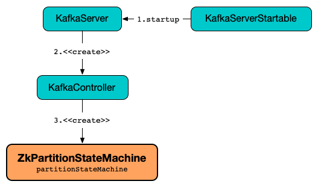

# ZkPartitionStateMachine

`ZkPartitionStateMachine` is a [PartitionStateMachine](PartitionStateMachine.md) of a [KafkaController](KafkaController.md#partitionStateMachine).



When requested to [handle partition state changes](#handleStateChanges), `ZkPartitionStateMachine` uses the [ControllerBrokerRequestBatch](#controllerBrokerRequestBatch) to [propagate them to all brokers in a cluster](AbstractControllerBrokerRequestBatch.md#sendRequestsToBrokers).

## Creating Instance

`ZkPartitionStateMachine` takes the following to be created:

* <span id="config"> [KafkaConfig](../KafkaConfig.md)
* <span id="stateChangeLogger"> `StateChangeLogger`
* <span id="controllerContext"> [ControllerContext](ControllerContext.md)
* <span id="zkClient"> [KafkaZkClient](../zk/KafkaZkClient.md)
* <span id="controllerBrokerRequestBatch"> [ControllerBrokerRequestBatch](ControllerBrokerRequestBatch.md)

`ZkPartitionStateMachine` is created along with a [KafkaController](KafkaController.md#partitionStateMachine).

## <span id="handleStateChanges"> Handling State Changes of Partitions

```scala
handleStateChanges(
  partitions: Seq[TopicPartition],
  targetState: PartitionState,
  partitionLeaderElectionStrategyOpt: Option[PartitionLeaderElectionStrategy]
): Map[TopicPartition, Either[Throwable, LeaderAndIsr]]
```

`handleStateChanges` is part of the [PartitionStateMachine](PartitionStateMachine.md#handleStateChanges) abstraction.

---

`handleStateChanges` does nothing and returns an empty collection when executed with no partitions.

`handleStateChanges` requests the [ControllerBrokerRequestBatch](#controllerBrokerRequestBatch) to [prepare a new batch](AbstractControllerBrokerRequestBatch.md#newBatch).

`handleStateChanges` [doHandleStateChanges](#doHandleStateChanges) (that may give some errors that are returned in the end).

In the end, `handleStateChanges` requests the [ControllerBrokerRequestBatch](#controllerBrokerRequestBatch) to [send controller requests to brokers](AbstractControllerBrokerRequestBatch.md#sendRequestsToBrokers).

### <span id="doHandleStateChanges"> doHandleStateChanges

```scala
doHandleStateChanges(
  partitions: Seq[TopicPartition],
  targetState: PartitionState,
  partitionLeaderElectionStrategyOpt: Option[PartitionLeaderElectionStrategy]
): Map[TopicPartition, Either[Throwable, LeaderAndIsr]]
```

---

`doHandleStateChanges` requests the [ControllerContext](#controllerContext) to [putPartitionStateIfNotExists](ControllerContext.md#putPartitionStateIfNotExists) to `NonExistentPartition` for every partition (in `partitions`).

`doHandleStateChanges` requests the [ControllerContext](#controllerContext) to [checkValidPartitionStateChange](ControllerContext.md#checkValidPartitionStateChange) with the given target `PartitionState` (that splits the partitions into valid and invalid partitions).

`doHandleStateChanges` [logInvalidTransition](#logInvalidTransition) for every invalid partition.

`doHandleStateChanges` branches off per the target state:

* [NewPartition](#doHandleStateChanges-NewPartition)
* [OnlinePartition](#doHandleStateChanges-OnlinePartition)
* [OfflinePartition or NonExistentPartition](#doHandleStateChanges-OfflinePartition-NonExistentPartition)

#### <span id="doHandleStateChanges-NewPartition"> NewPartition

For `NewPartition` target state, `doHandleStateChanges` goes over the valid partitions and for every partition prints out the following TRACE message to the logs and requests the <<controllerContext, ControllerContext>> to <<kafka-controller-ControllerContext.adoc#putPartitionState, putPartitionState>> to `NewPartition` state.

```text
Changed partition [partition] state from [state] to NewPartition with assigned replicas [partitionReplicaAssignment]
```

#### <span id="doHandleStateChanges-OnlinePartition"> OnlinePartition

`doHandleStateChanges` finds uninitialized partitions (among the valid partitions with `NewPartition` state).

`doHandleStateChanges` finds partitions to elect a leader (among the valid partitions with `OfflinePartition` or `OnlinePartition` state).

For uninitialized partitions, `doHandleStateChanges` [initializeLeaderAndIsrForPartitions](#initializeLeaderAndIsrForPartitions), prints out the following INFO message to the logs and requests the [ControllerContext](#controllerContext) to [putPartitionState](ControllerContext.md#putPartitionState) to `OnlinePartition` state.

```text
Changed partition [partition] from [state] to OnlinePartition with state [leaderAndIsr]
```

For partitions to elect a leader, `doHandleStateChanges` [electLeaderForPartitions](#electLeaderForPartitions) with the input [PartitionLeaderElectionStrategy](#PartitionLeaderElectionStrategy).

For every partition with leader election successful, `doHandleStateChanges` prints out the following INFO message to the logs and requests the [ControllerContext](#controllerContext) to [putPartitionState](ControllerContext.md#putPartitionState) to `OnlinePartition` state.

```text
Changed partition [partition] from [state] to OnlinePartition with state [leaderAndIsr]
```

In the end, `doHandleStateChanges` returns the partitions with election failed.

#### <span id="doHandleStateChanges-OfflinePartition-NonExistentPartition"> OfflinePartition or NonExistentPartition

For `OfflinePartition` target state, `doHandleStateChanges` goes over the valid partitions and for every partition prints out the following TRACE message to the logs and requests the <<controllerContext, ControllerContext>> to <<kafka-controller-ControllerContext.adoc#putPartitionState, putPartitionState>> to `OfflinePartition` state.

```text
Changed partition [partition] state from [state] to OfflinePartition
```

For `NonExistentPartition` target state, `doHandleStateChanges` goes over the valid partitions and for every partition prints out the following TRACE message to the logs and requests the <<controllerContext, ControllerContext>> to <<kafka-controller-ControllerContext.adoc#putPartitionState, putPartitionState>> to `NonExistentPartition` state.

```text
Changed partition [partition] state from [state] to NonExistentPartition
```

### <span id="electLeaderForPartitions"> electLeaderForPartitions

```scala
electLeaderForPartitions(
  partitions: Seq[TopicPartition],
  partitionLeaderElectionStrategy: PartitionLeaderElectionStrategy
): Map[TopicPartition, Either[Throwable, LeaderAndIsr]]
```

---

`electLeaderForPartitions` [doElectLeaderForPartitions](#doElectLeaderForPartitions) until all the given partitions have partition leaders elected successfully or not.

For any partition to retry a leader election, `electLeaderForPartitions` prints out the following INFO message to the logs:

```text
Retrying leader election with strategy [partitionLeaderElectionStrategy] for partitions [remaining]
```

## <span id="doElectLeaderForPartitions"> doElectLeaderForPartitions

```scala
doElectLeaderForPartitions(
  partitions: Seq[TopicPartition],
  partitionLeaderElectionStrategy: PartitionLeaderElectionStrategy
): (Map[TopicPartition, Either[Exception, LeaderAndIsr]], Seq[TopicPartition])
```

`doElectLeaderForPartitions` requests the [KafkaZkClient](#zkClient) for the [partition states](../zk/KafkaZkClient.md#getTopicPartitionStatesRaw) (with `LeaderAndIsr` information).

For every partition state response, `doElectLeaderForPartitions` [decodes the response](../zk/TopicPartitionStateZNode.md#decode) (if possible) and adds it to `validLeaderAndIsrs` internal registry (of `(TopicPartition, LeaderAndIsr)` pairs) or to failed elections (of `TopicPartition, Either[Exception, LeaderAndIsr]`s).

`doElectLeaderForPartitions` branches off per the input [PartitionLeaderElectionStrategy](PartitionStateMachine.md#PartitionLeaderElectionStrategy) that gives partitions with and without leaders elected.

* For [OfflinePartitionLeaderElectionStrategy](PartitionStateMachine.md#OfflinePartitionLeaderElectionStrategy), `doElectLeaderForPartitions` [collectUncleanLeaderElectionState](#collectUncleanLeaderElectionState) with the valid partitions for election followed by [leaderForOffline](Election.md#leaderForOffline).

* For [ReassignPartitionLeaderElectionStrategy](PartitionStateMachine.md#ReassignPartitionLeaderElectionStrategy), `doElectLeaderForPartitions` [leaderForReassign](Election.md#leaderForReassign)

* For [PreferredReplicaPartitionLeaderElectionStrategy](PartitionStateMachine.md#PreferredReplicaPartitionLeaderElectionStrategy), `doElectLeaderForPartitions` [leaderForPreferredReplica](Election.md#leaderForPreferredReplica)

* For [ControlledShutdownPartitionLeaderElectionStrategy](PartitionStateMachine.md#ControlledShutdownPartitionLeaderElectionStrategy), `doElectLeaderForPartitions` [leaderForControlledShutdown](Election.md#leaderForControlledShutdown)

`doElectLeaderForPartitions` adds the partitions with no leader elected to failed elections.

`doElectLeaderForPartitions` requests the [KafkaZkClient](#zkClient) to [updateLeaderAndIsr](../zk/KafkaZkClient.md#updateLeaderAndIsr) (with the adjusted leader and ISRs).

For every successfully-updated partition (in [Zookeeper](../zk/KafkaZkClient.md#updateLeaderAndIsr)), `doElectLeaderForPartitions` requests the following:

1. The [ControllerContext](#controllerContext) to [partitionFullReplicaAssignment](ControllerContext.md#partitionFullReplicaAssignment) and [record the partition leadership](ControllerContext.md#putPartitionLeadershipInfo)

1. The [ControllerBrokerRequestBatch](#controllerBrokerRequestBatch) to [addLeaderAndIsrRequestForBrokers](AbstractControllerBrokerRequestBatch.md#addLeaderAndIsrRequestForBrokers) to every live replica broker (with `isNew` flag off)

`doElectLeaderForPartitions` prints out the following DEBUG message to the logs for every partition with no leader elected:

```text
Controller failed to elect leader for partition [partition].
Attempted to write state [partition], but failed with bad ZK version.
This will be retried.
```

## Logging

Enable `ALL` logging level for `kafka.controller.ZkPartitionStateMachine` logger to see what happens inside.

Add the following line to `config/log4j.properties`:

```text
log4j.logger.kafka.controller.ZkPartitionStateMachine=ALL
```

Refer to [Logging](../logging.md).

### <span id="logIdent"> logIdent

`ZkPartitionStateMachine` uses the following logging prefix (with the [broker.id](../KafkaConfig.md#broker.id)):

```text
[PartitionStateMachine controllerId=[brokerId]]
```

## Review Me

## <span id="initializeLeaderAndIsrForPartitions"> initializeLeaderAndIsrForPartitions

```scala
initializeLeaderAndIsrForPartitions(
  partitions: Seq[TopicPartition]): Seq[TopicPartition]
```

`initializeLeaderAndIsrForPartitions` starts by requesting the <<controllerContext, ControllerContext>> for the <<kafka-controller-ControllerContext.adoc#partitionReplicaAssignment, partition replica assignment>> for every partition (in the given `partitions`).

From the partition replica assignments, `initializeLeaderAndIsrForPartitions` makes sure that the replicas are all <<kafka-controller-ControllerContext.adoc#isReplicaOnline, online>> only (per the <<controllerContext, ControllerContext>>) so all other partitions are filtered out (_excluded_).

`initializeLeaderAndIsrForPartitions` splits the partitions (with online replicas only) into two sets with and without replicas (`partitionsWithLiveReplicas` and `partitionsWithoutLiveReplicas`, respectively).

For every partition without live (online) replicas, `initializeLeaderAndIsrForPartitions` <<logFailedStateChange, prints out the following ERROR message and the StateChangeFailedException to the logs>>:

```text
Controller [controllerId] epoch [epoch] failed to change state for partition [partition] from NewPartition to OnlinePartition
```

```text
Controller [controllerId] epoch [epoch] encountered error during state change of partition [partition] from New to Online, assigned replicas are [[replicas]], live brokers are [[liveBrokerIds]]. No assigned replica is alive.
```

`initializeLeaderAndIsrForPartitions` converts the partitions with live (online) replicas into `leaderIsrAndControllerEpochs` (`LeaderIsrAndControllerEpoch` with `LeaderAndIsr`) and for every pair `initializeLeaderAndIsrForPartitions` requests the <<zkClient, KafkaZkClient>> to <<kafka-zk-KafkaZkClient.adoc#createTopicPartitionStatesRaw, create state znodes for the partitions>>.

For every successful response (from <<kafka-zk-KafkaZkClient.adoc#createTopicPartitionStatesRaw, creating partition state znodes>>), `initializeLeaderAndIsrForPartitions` requests the following:

. The <<controllerContext, ControllerContext>> to record the `leaderIsrAndControllerEpoch` for the partition (in the <<kafka-controller-ControllerContext.adoc#partitionLeadershipInfo, partitionLeadershipInfo>> registry)

. The <<controllerBrokerRequestBatch, ControllerBrokerRequestBatch>> to <<kafka-controller-AbstractControllerBrokerRequestBatch.adoc#addLeaderAndIsrRequestForBrokers, addLeaderAndIsrRequestForBrokers>> (with `isNew` flag on)

In the end, `initializeLeaderAndIsrForPartitions` returns the partitions that were successfully initialized.

In case of `ControllerMovedException` (while...FIXME), `initializeLeaderAndIsrForPartitions`...FIXME

In case of any other error (`Exception`) (while...FIXME), `initializeLeaderAndIsrForPartitions`...FIXME

NOTE: `initializeLeaderAndIsrForPartitions` is used exclusively when `ZkPartitionStateMachine` is requested to <<doHandleStateChanges, handle partition state changes>> (for <<doHandleStateChanges-OnlinePartition, partitions in NewPartition state that are transitioned to OnlinePartition target state>>).
