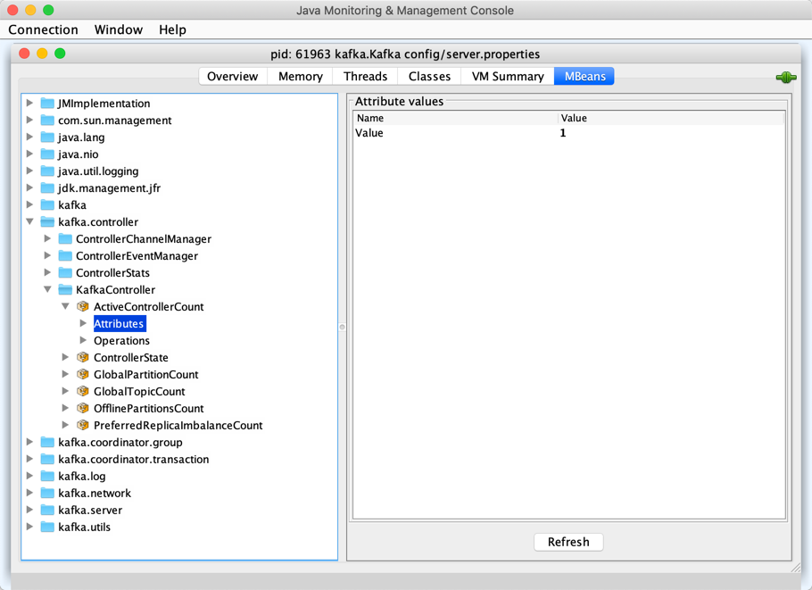

# Controller Election

**Controller Election** is a process to elect a Kafka broker as the controller in a Kafka cluster.

Kafka Controller Election process relies heavily on the features of Apache ZooKeeper that acts as the source of truth and guarantees that only one broker can ever be elected (due to how **ephemeral nodes** work).

!!! quote "[Nodes and ephemeral nodes](https://zookeeper.apache.org/doc/current/zookeeperOver.html#Nodes+and+ephemeral+nodes)"

    ZooKeeper also has the notion of ephemeral nodes. These znodes exists as long as the session that created the znode is active. When the session ends the znode is deleted.

!!! quote "[Leader Election](https://zookeeper.apache.org/doc/current/recipes.html#sc_leaderElection)"

    A simple way of doing leader election with ZooKeeper is to use the SEQUENCE|EPHEMERAL flags when creating znodes that represent "proposals" of clients. The idea is to have a znode, say "/election"

When `ControllerEventThread` is requested to process [Startup](ControllerEvent.md#Startup) and [Reelect](ControllerEvent.md#Reelect) controller events, `KafkaController` (instance that runs on every Kafka broker) is requested to [elect](KafkaController.md#elect).

!!! tip
    Consult [Demo: Kafka Controller Election](../demo/controller-election.md) to learn about the process.

Given that all the state is in ZooKeeper use `zookeeper-shell` script to know which broker is the active controller.

``` console
$ ./bin/zookeeper-shell.sh :2181 get /controller
Connecting to :2181

{"version":1,"brokerid":0,"timestamp":"1543491973573"}
cZxid = 0x48
ctime = Thu Nov 29 12:46:13 CET 2018
mZxid = 0x48
mtime = Thu Nov 29 12:46:13 CET 2018
pZxid = 0x48
cversion = 0
dataVersion = 0
aclVersion = 0
ephemeralOwner = 0x100073f07ba0001
dataLength = 54
numChildren = 0
```

If you receive `Node does not exist: /controller` error message, that means that no Kafka broker has been elected as the active controller yet (or that you use an incorrect ZooKeeper server to talk to).

You could also use `nc` to talk to ZooKeeper in a more direct way (that allows for `dump` command).

``` console
$ nc localhost 2181
dump
SessionTracker dump:
Session Sets (2):
0 expire at Fri Jan 02 10:57:03 CET 1970:
1 expire at Fri Jan 02 10:57:06 CET 1970:
  0x100073f07ba0001
ephemeral nodes dump:
Sessions with Ephemerals (1):
0x100073f07ba0001:
  /controller
  /brokers/ids/0
```

From [Notable changes in 0.10.1.0](http://kafka.apache.org/documentation/#upgrade_1010_notable) in the official documentation of Apache Kafka:

> The recommended way to detect if a given broker is the controller is via the `kafka.controller:type=KafkaController,name=ActiveControllerCount` metric.



## Forcing Controller Re-election

Controller re-election may be forced by running the following command:

```console
bin/zookeeper-shell.sh localhost delete /controller
```

!!! tip
    Monitor [logs/controller.log](KafkaController.md#logging) to see what happens.

## Controller ID Registered (in ZooKeeper)

The election process stops when [there is a controller ID registered in Zookeeper](KafkaController.md#elect) (using `KafkaZkClient` that [gets the ID of the active controller](../zk/KafkaZkClient.md#getControllerId) and the ID is any number but `-1`).

## No Controller ID Registered (in ZooKeeper)

If there is no controller ID registered, every `KafkaController` instance tries to [register itself as the controller (in Zookeeper) and increment the controller epoch](KafkaController.md#elect) (using [KafkaZkClient](../zk/KafkaZkClient.md#registerControllerAndIncrementControllerEpoch)).

In the end, the active `KafkaController` is requested to [onControllerFailover](KafkaController.md#onControllerFailover).
