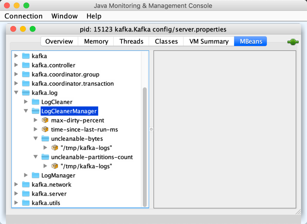

# LogCleanerManager

`LogCleanerManager` is used exclusively by [LogCleaner](LogCleaner.md#cleanerManager) to manage the state of partitions for [Log Cleanup](../log-cleanup/index.md).

## Creating Instance

`LogCleanerManager` takes the following to be created:

* <span id="logDirs"> Log directories
* <span id="logs"> `TopicPartition`s and their [UnifiedLog](UnifiedLog.md)s (`Pool[TopicPartition, UnifiedLog]`)
* <span id="logDirFailureChannel"> `LogDirFailureChannel`

`LogCleanerManager` is created along with a [LogCleaner](LogCleaner.md#cleanerManager).

## Performance Metrics

`LogCleanerManager` is a [KafkaMetricsGroup](../metrics/KafkaMetricsGroup.md) and registers the following performance metrics in **kafka.log:type=LogCleanerManager** group.

Metric Name | Description
------------|------------
 max-dirty-percent |
 time-since-last-run-ms |
 uncleanable-bytes | (for every [log directory](#logDirs))
 uncleanable-partitions-count | (for every [log directory](#logDirs))



## <span id="grabFilthiestCompactedLog"> grabFilthiestCompactedLog

```scala
grabFilthiestCompactedLog(
  time: Time,
  preCleanStats: PreCleanStats = new PreCleanStats()): Option[LogToClean]
```

`grabFilthiestCompactedLog`...FIXME

---

`grabFilthiestCompactedLog` is used when:

* `CleanerThread` is requested to [clean the filthiest log](CleanerThread.md#cleanFilthiestLog)

## <span id="isCompactAndDelete"> isCompactAndDelete

```scala
isCompactAndDelete(
  log: UnifiedLog): Boolean
```

`isCompactAndDelete` holds true when the given [UnifiedLog](UnifiedLog.md) is [compact](LogConfig.md#compact) and [delete](LogConfig.md#delete).

---

`isCompactAndDelete` holds true only when both [compact](../log-cleanup/index.md#compact) and [delete](../log-cleanup/index.md#delete) cleanup policies are included in the [cleanup.policy](../log-cleanup/index.md#cleanup.policy) configuration property. Otherwise, `isCompactAndDelete` flag is disabled (`false`).

## Logging

`LogCleanerManager` uses [kafka.log.LogCleaner](LogCleaner.md#logging) logger.
