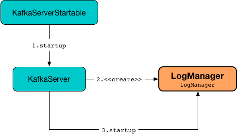

# LogManager



## Creating Instance

`LogManager` takes the following to be created:

* <span id="logDirs"> [Log directories](../KafkaConfig.md#logDirs)
* <span id="initialOfflineDirs"> Initial offline directories
* <span id="configRepository"> `ConfigRepository`
* <span id="initialDefaultConfig"> `LogConfig`
* <span id="cleanerConfig"> `CleanerConfig`
* <span id="recoveryThreadsPerDataDir"> [num.recovery.threads.per.data.dir](../KafkaConfig.md#numRecoveryThreadsPerDataDir)
* <span id="flushCheckMs"> [log.flush.scheduler.interval.ms](../KafkaConfig.md#logFlushSchedulerIntervalMs)
* <span id="flushRecoveryOffsetCheckpointMs"> [log.flush.offset.checkpoint.interval.ms](../KafkaConfig.md#logFlushOffsetCheckpointIntervalMs)
* <span id="flushStartOffsetCheckpointMs"> [log.flush.start.offset.checkpoint.interval.ms](../KafkaConfig.md#logFlushStartOffsetCheckpointIntervalMs)
* <span id="retentionCheckMs"> [log.retention.check.interval.ms](../KafkaConfig.md#logCleanupIntervalMs)
* <span id="maxTransactionTimeoutMs"> [transaction.max.timeout.ms](../KafkaConfig.md#transactionMaxTimeoutMs)
* <span id="maxPidExpirationMs"> [transactional.id.expiration.ms](../KafkaConfig.md#transactionalIdExpirationMs)
* <span id="interBrokerProtocolVersion"> [inter.broker.protocol.version](../KafkaConfig.md#interBrokerProtocolVersion)
* <span id="scheduler"> `Scheduler`
* <span id="brokerTopicStats"> `BrokerTopicStats`
* <span id="logDirFailureChannel"> `LogDirFailureChannel`
* <span id="time"> `Time`
* <span id="keepPartitionMetadataFile"> `keepPartitionMetadataFile`

`LogManager` is created using [apply](#apply) factory method.

### <span id="apply"> Creating LogManager

```scala
apply(
  config: KafkaConfig,
  initialOfflineDirs: Seq[String],
  configRepository: ConfigRepository,
  kafkaScheduler: KafkaScheduler,
  time: Time,
  brokerTopicStats: BrokerTopicStats,
  logDirFailureChannel: LogDirFailureChannel,
  keepPartitionMetadataFile: Boolean): LogManager
```

`apply` [extracts log-related configuration properties](LogConfig.md#extractLogConfigMap) (from the given [KafkaConfig](../KafkaConfig.md)) and creates a [LogConfig](LogConfig.md).

`apply` creates a [LogCleaner](LogCleaner.md#cleanerConfig).

In the end, `apply` creates a [LogManager](#creating-instance) based on some [configuration properties](../KafkaConfig.md).

---

`apply` is used when:

* `BrokerServer` is requested to [start up](../kraft/BrokerServer.md#logManager)
* `KafkaServer` is requested to [start up](../broker/KafkaServer.md#logManager)

## <span id="KafkaMetricsGroup"> KafkaMetricsGroup

`LogManager` is a [KafkaMetricsGroup](../metrics/KafkaMetricsGroup.md).

## <span id="currentLogs"> Current Logs

```scala
currentLogs: Pool[TopicPartition, UnifiedLog]
```

`LogManager` defines `currentLogs` internal registry of [UnifiedLog](UnifiedLog.md)s per `TopicPartition`.

`LogManager` uses the `currentLogs` registry when:

* [startupWithConfigOverrides](#startupWithConfigOverrides) (to create a [LogCleaner](LogCleaner.md) when [enabled](CleanerConfig.md#enableCleaner))
* [handleLogDirFailure](#handleLogDirFailure)
* [loadLog](#loadLog)
* [truncateTo](#truncateTo)
* [truncateFullyAndStartAt](#truncateFullyAndStartAt)
* [getLog](#getLog)
* [getOrCreateLog](#getOrCreateLog)
* _and many more_

## <span id="getLog"> Looking Up Log

```scala
getLog(
  topicPartition: TopicPartition,
  isFuture: Boolean = false): Option[UnifiedLog]
```

With the input `isFuture` enabled, `getLog` uses the [futureLogs](#futureLogs) registry to look up the [UnifiedLog](UnifiedLog.md) for the input `TopicPartition` (if available). Otherwise, `getLog` uses the [currentLogs](#currentLogs) registry.

---

`getLog` is used when:

* `Partition` is requested to [topicId](../Partition.md#topicId) and [getOffsetByTimestamp](../Partition.md#getOffsetByTimestamp)
* `LogManager` is requested to [maybeUpdatePreferredLogDir](#maybeUpdatePreferredLogDir), [getOrCreateLog](#getOrCreateLog), [asyncDelete](#asyncDelete)
* `ReplicaManager` is requested to [getLog](../ReplicaManager.md#getLog), [maybeAddLogDirFetchers](../ReplicaManager.md#maybeAddLogDirFetchers)

## getOrCreateLog { #getOrCreateLog }

```scala
getOrCreateLog(
  topicPartition: TopicPartition,
  isNew: Boolean = false,
  isFuture: Boolean = false,
  topicId: Option[Uuid]): UnifiedLog
```

`getOrCreateLog`...FIXME

---

`getOrCreateLog` is used when:

* `Partition` is requested to [createLog](../Partition.md#createLog)

## startup { #startup }

```scala
startup(
  topicNames: Set[String]): Unit
```

`startup` [startupWithConfigOverrides](#startupWithConfigOverrides) with the [currentDefaultConfig](#currentDefaultConfig) and [fetchTopicConfigOverrides](#fetchTopicConfigOverrides).

---

`startup` is used when:

* `KafkaServer` is requested to [startup](../broker/KafkaServer.md#startup)
* `BrokerMetadataPublisher` is requested to [initializeManagers](../metadata/BrokerMetadataPublisher.md#initializeManagers)

### startupWithConfigOverrides { #startupWithConfigOverrides }

```scala
startupWithConfigOverrides(
  defaultConfig: LogConfig,
  topicConfigOverrides: Map[String, LogConfig]): Unit
```

`startupWithConfigOverrides`...FIXME

### loadLogs { #loadLogs }

```scala
loadLogs(
  defaultConfig: LogConfig,
  topicConfigOverrides: Map[String, LogConfig]): Unit
```

`loadLogs`...FIXME

### loadLog { #loadLog }

```scala
loadLog(
  logDir: File,
  hadCleanShutdown: Boolean,
  recoveryPoints: Map[TopicPartition, Long],
  logStartOffsets: Map[TopicPartition, Long],
  defaultConfig: LogConfig,
  topicConfigOverrides: Map[String, LogConfig],
  numRemainingSegments: ConcurrentMap[String, Int]): UnifiedLog
```

`loadLog`...FIXME

## Logging

Enable `ALL` logging level for `kafka.log.LogManager` logger to see what happens inside.

Add the following line to `config/log4j.properties`:

```text
log4j.logger.kafka.log.LogManager=ALL
```

Refer to [Logging](../logging.md).
